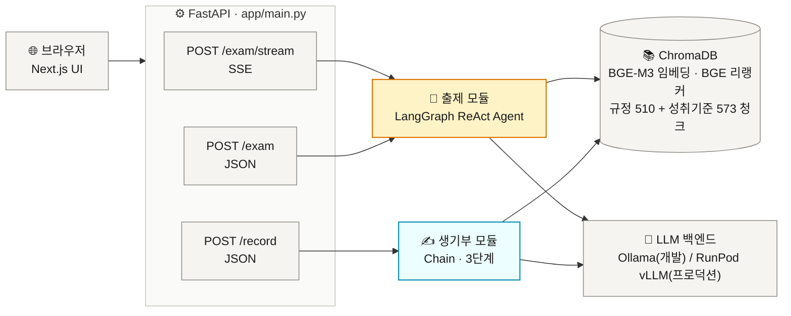
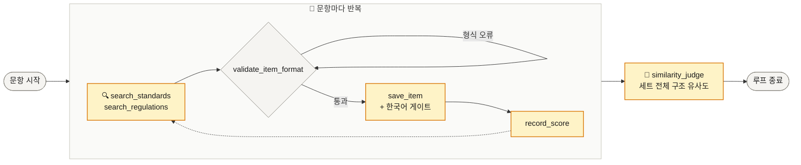
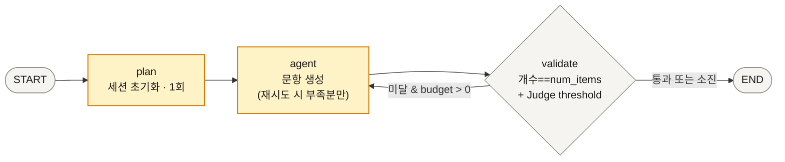
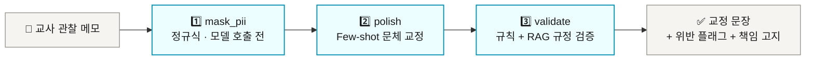
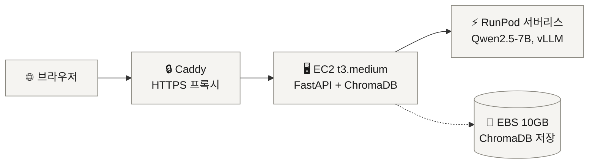

<div align="center">

# 분필 (bunpil)

**고등학교 사회 교사를 위한 AI 어시스턴트 — 문항 출제 · 생활기록부 윤문**


[개요](#개요) · [아키텍처](#아키텍처) · [설계 원칙](#설계-원칙) · [엔지니어링 하이라이트](#엔지니어링-하이라이트) · [품질 평가](#품질-평가) · [빠른 시작](#빠른-시작-로컬) · [배포](#배포-프로덕션)

</div>

---

## 개요

교사의 반복 업무 중 가장 시간이 많이 드는 두 가지 — **시험 문항 출제**와 **학교생활기록부 문구 작성** — 를 소형 오픈소스 LLM(Qwen2.5-7B)으로 보조하는 서비스입니다. 포트폴리오 프로젝트이자 현직 교사 1인이 실사용 중입니다.

| 모듈 | 입력 | 처리 | 출력 |
|---|---|---|---|
| 📝 **문항 출제** | 예시 문제 텍스트 붙여넣기 | LangGraph ReAct 에이전트가 교육과정·규정 RAG를 참조하며 생성 → 형식·언어·개수 검증 → 미달 시 부족분만 이어서 재시도 | 지정 개수의 새 문항 세트 (예시와 유사한 유형·난이도 구성) |
| ✍️ **생기부 윤문** | 교사 관찰 메모 | PII 마스킹(모델 호출 **전**) → 생기부 문체 교정 → 규정 위반 검증 | 교정된 문장 + 위반 플래그 + 교사 책임 고지 |

프로젝트의 특징 세 가지:

- **로컬 ↔ 프로덕션 전환 가능한 LLM 추상화** — 개발은 Ollama(로컬), 프로덕션은 RunPod 서버리스(vLLM). 환경변수 하나로 전환
- **"LLM이 판단하고, 코드가 결정한다"** — 품질·유사도 판단은 LLM에게, 통과/재시도/개수/언어 검증은 결정론적 코드에 ([설계 원칙](#설계-원칙))
- **평가 기반 개발** — 사람이 라벨링한 골든셋 6종으로 검색·생성·마스킹 품질을 수치로 추적 ([EVAL.md](./EVAL.md)), 삽질은 [TROUBLESHOOTING.md](./TROUBLESHOOTING.md)에 기록

---

## 아키텍처



| 구분 | 기술 |
|---|---|
| 백엔드 | FastAPI (비동기) |
| 프론트엔드 | Next.js (`frontend/`) |
| 에이전트 | LangGraph (ReAct) |
| 생기부 체인 | LangChain (수동 루프) |
| RAG | ChromaDB + BGE-M3 임베딩 + BGE-reranker (모두 CPU) |
| LLM 서빙 | Ollama (개발) / RunPod 서버리스 vLLM (프로덕션) |
| 트레이싱 | LangSmith (선택, `LANGCHAIN_TRACING_V2=true` 시 자동 활성화) |
| 배포 | AWS EC2 t3.medium + EBS + RunPod 서버리스 + Caddy HTTPS |

### 출제 모듈 — ReAct 에이전트

에이전트(LLM)가 추론과 문항 생성을 **직접** 담당하고, 도구 6개는 검색·저장·검증의 **순수 계산**만 수행합니다(도구 내부 LLM 호출 없음 — LLM을 도구 안에 중첩하는 안티패턴 제거).

| 도구 | 역할 |
|---|---|
| `search_standards` / `search_regulations` | 성취기준·법령 RAG 검색 |
| `validate_item_format` | 선지 4개·①②③④ 형식 등 결정론적 형식 검증 (오류 시 수정 지침 반환 → 자기교정) |
| `save_item` | 문항 저장 — 한국어 검증 게이트 통과 시에만 저장 |
| `record_score` | 문항 품질 자체 평가 기록 |
| `similarity_judge` | 세트 완성 후 예시 문제와의 구조 유사도 자체 평가 |



세트 전체는 LangGraph 그래프가 관리합니다. `validate` 노드가 코드로 판정(문항 개수 일치 + `similarity_judge` 결과 threshold)하고, 미달 시 최대 5회까지 `agent`로 재시도합니다 — 이때 **이미 만든 문항은 유지하고 부족분만 이어서 작성**합니다(부분 진행 보존).



### 생기부 모듈 — 3단계 체인

순서가 고정된 파이프라인입니다. **PII 마스킹이 반드시 모델 호출보다 앞**에 있어, 원문 개인정보가 LLM에 도달하지 않습니다.



### API와 스트리밍

- **`POST /exam/stream`** (SSE) — UI가 사용하는 기본 경로. `graph.stream(stream_mode="updates")`로 LangGraph 노드 완료 시점마다 진행 이벤트를 전송합니다. POST 요청이라 브라우저 네이티브 `EventSource`(GET 전용) 대신 프론트엔드가 `fetch` + `ReadableStream`을 수동 파싱합니다.
- **`POST /exam`** (JSON 단발) — 동일 로직의 대안 엔드포인트 (curl 등 비-브라우저 클라이언트용)
- **`POST /record`** (JSON 단발) — 생기부 윤문

```
data: {"status": "truncated", "msg": "입력이 길어 앞부분만 반영되었습니다."}  # 8,000자 초과 시만
data: {"status": "progress",  "msg": "준비 중..."}
data: {"status": "progress",  "msg": "AI가 문항을 생성하고 있습니다. 수 분 소요됩니다..."}
data: {"status": "progress",  "msg": "생성된 문항의 구조적 유사도를 검증하고 있습니다..."}
data: {"status": "progress",  "msg": "문항 세트를 다시 생성하고 있습니다 (2번째 시도)..."}  # 재시도(최대 5회)마다
data: {"status": "done",      "items": [...], "validation_passed": true, "truncated": false}
data: {"status": "error",     "msg": "...", "detail": "..."}  # 예외 발생 시
```

<details>
<summary><b>동시성 설계 (펼치기)</b></summary>

- **요청 간 세션 격리**: 출제 요청별 컨텍스트를 `contextvars.ContextVar`로 분리. `asyncio.to_thread` + `contextvars.copy_context()`로 worker 스레드에 전파.
- **이벤트 루프 비블로킹**: `/exam`은 `asyncio.to_thread`로 LangGraph 실행. `/exam/stream`은 `graph.stream()`(동기 제너레이터)을 executor 스레드에서 돌리며 `asyncio.Queue`로 이벤트만 이벤트 루프에 전달. `/record`는 Chain 전체가 async이므로 `await chain.run()`으로 직접 호출.

</details>

---

## 설계 원칙

**1. LLM이 판단하고, 코드가 결정한다.**
LLM의 자기 평가는 "기록"까지만 — 그것으로 무엇을 할지는 전부 결정론적 코드가 정합니다. 판단 로직을 LLM에 맡겼다가 회수한 이력이 이 프로젝트의 핵심 학습 곡선입니다.

| 검증 대상 | 판단 주체 | 근거 |
|---|---|---|
| 구조 유사도 (유형·난이도) | LLM (`similarity_judge`) → threshold는 코드 | 정성 판단은 LLM이 낫고, 커트라인은 코드가 안정적 |
| 문항 개수 | 코드 (`len(items) == num_items`) | LLM Judge에 맡겼다가 설계 오류 발견 후 이관 |
| 언어 (한국어) | 코드 (`save_item` 한글 비율 게이트) | 중국어 오염 문항을 저장 전 차단 |
| 재시도 여부 | 코드 (budget 루프) | LLM에 재시도 판단을 맡기면 수량 제어가 깨짐 |

**2. 도구는 순수 계산만.**
ReAct 도구 내부에 LLM 호출이 없습니다. 추론·생성은 에이전트가 직접, 도구는 검색·저장·검증만.

**3. 보안 하드룰 (예외 없음).**
실제 학생 데이터 미사용(전부 합성/익명) · PII 마스킹은 모델 호출 **이전** · 사용자 입력(메모·예시 문제) 비저장(요청 처리 중에만 메모리에 존재) · 로그·캐시에 PII 금지 · 생기부는 메모에 없는 사실 추가 금지("생성"이 아닌 "다듬기") + 교사 책임 고지.

**4. 평가 기반 개발.**
골든셋은 코드에 하드코딩하지 않고 전부 `data/golden/*.json`으로 관리하며(파일별 용도는 [data/golden/README.md](./data/golden/README.md)), 모델·프롬프트 변경마다 [EVAL.md](./EVAL.md)에 결과 이력을 남깁니다.

---

## 엔지니어링 하이라이트

소형 LLM(7B)으로 에이전트를 만들며 겪은 문제와 해결 과정입니다. 상세 진단 기록은 [TROUBLESHOOTING.md](./TROUBLESHOOTING.md) 참고.

| 문제 | 진단 | 해결 |
|---|---|---|
| 골든셋 생성 성공률이 ~37%에서 갑자기 **6%로 급락**, 모델이 중국어·스페인어 섞인 응답 | 로컬 Ollama가 `num_ctx` 기본값 **4096**으로 실행 중이었음(모델은 32K 지원). 멀티턴 ReAct + RAG 검색 결과 누적이 몇 턴 만에 한도를 초과 → 컨텍스트가 잘리며 시스템 프롬프트 유실. 동일 케이스 재현: 4096에서 0/5문항 → 16384에서 5/5문항 | `num_ctx=16384` 명시. vLLM(프로덕션)은 모델 네이티브 값을 쓰므로 **로컬 개발 환경에만 있던 설정 격차**였음 — dev/prod parity의 실례 |
| 생성 문항의 **45%에 중국어 오염** — "한국어로만 응답" 지시에도 발생 | LangSmith 트레이스 100건 정량 분석: 오염 출력의 입력 크기 중앙값 11,263자 vs 정상 8,009자 — 컨텍스트가 길수록 오염 확률이 오르는 **확률적 드리프트**. 오염 문항이 재시도 프롬프트에 실려 다음 시도로 전파되는 캐스케이드 경로도 확인 | `save_item`에 결정론적 한국어 게이트(한글 부재 또는 한자 비율 ≥5% 시 저장 거부 + 재작성 피드백). 기존 오염 사례 9건 소급 판정에서 수동 분류와 100% 일치 |
| "생성 개수 = 예시 문제 개수" 전제로 만든 count_match 검증이 실제 요구사항과 불일치 | 개수는 예시와 무관하게 사용자가 지정하는 값(`num_items`)이어야 함 — **골든셋 라벨링 직전에 설계 전제 자체가 틀렸음을 발견** | count_match를 LLM Judge에서 제거하고 `len(items)==num_items` 코드 검증으로 이관. 골든셋 전면 재생성 |
| 생성 프롬프트를 개선했는데 eval 수치가 **전혀 안 변함** | eval의 문항 품질 평가는 하드코딩된 고정 30문항을 채점하는 구조 — 생성 코드를 아무리 바꿔도 이 지표에 반영될 수 없었음 | 실제로 문항을 새로 생성해 채점하는 별도 검증 스크립트 작성. "eval이 존재하는가"와 "내 변경이 eval이 실제로 exercise하는 경로에 있는가"는 별개 |
| 재시도마다 이전 시도의 문항까지 전부 폐기 → num_items가 클수록 성공률 급락 | 재시도 구조가 세트 전체 재생성 방식이었음 | **부분 진행 보존**: 재시도 시 저장된 문항은 유지하고 "나머지 N개만 작성" 프롬프트로 이어서 생성. 개수 기준으로 적용 전 14건 중 부족 실패 8건 → 적용 후 6건 전부 목표 근접 달성(통제 실험은 아닌 생성 이력 기반 비교) |

---

## 품질 평가

> 지표 전체 목록·골든셋 현황·결과 이력은 [EVAL.md](./EVAL.md)에서 계속 갱신합니다. 아래는 최신 스냅샷(2026-07 기준, qwen2.5:7b)입니다.

### 출제 모듈 — `scripts/eval_exam.py`

| 지표 | n | 기준 | 실측 |
|---|---|---|---|
| 검색 Recall@5 | 21 | ≥ 0.80 | **0.905** ✅ |
| 검색 MRR | 21 | 참고값 | 0.659 |
| LLM Judge 종합평균 | 30 | ≥ 4.0 / 5 | 3.68 ❌ |
| Judge 신뢰도 (Cohen's κ) | 30 | ≥ 0.4 | 0.328 ❌ |
| Judge 신뢰도 (±1 일치율) | 30 | ≥ 0.7 | **0.800** ✅ |
| 구조 유사도 Judge 신뢰도 | 20 | 미정 | 라벨링 대기 |

- 검색 수치는 LLM과 무관한 BGE-M3 + reranker 파이프라인 성능. past_exams 컬렉션 제거 후 0.679→0.905로 상승
- Judge 종합평균 미달의 주원인은 오답매력도(2.5/5) — 생성 프롬프트에 오답 구성 지시·Judge 프롬프트에 5점 앵커를 추가해 2.50→2.85로 개선 중(목표 4.0, 로드맵 참고)
- 구조 유사도 골든셋(n=20)은 실제 qwen2.5:7b 출력 기반으로 전면 재생성 완료, 사람 라벨링 대기 중

### 생기부 모듈 — `scripts/eval_record.py`

| 지표 | n | 기준 | 실측 |
|---|---|---|---|
| PII 마스킹 FN율 | 20 | = 0 | **0.000** ✅ |
| 키워드 사실추가율 | 20 | = 0 | **0.000** ✅ |
| NLI 사실추가율 | 20 | = 0 | 0.100 ❌ |
| 규정 위반 Recall | 50 | ≥ 0.95 | 0.840 ❌ |
| 규정 위반 F1 | 50 | 참고값 | 0.857 |

- PII 마스킹·키워드 검사는 규칙 기반이라 모델 크기와 무관하게 안정적
- NLI 사실추가율·위반 Recall은 1.5b→7b 전환으로 크게 개선(0.7~0.9→0.1, 0.6→0.84)됐으나 기준 미달 — 위반 탐지 프롬프트·규정 RAG 보강 예정

<details>
<summary><b>기능 검증 결과 — test_*.py (펼치기)</b></summary>

| 레이어 | 스크립트 | 목적 | 실행 시점 |
|---|---|---|---|
| 기능 검증 | `test_*.py` | 파이프라인이 에러 없이 동작하는가 | 개발 중 수시 |
| 품질 평가 | `eval_*.py` | 얼마나 잘 하는가 (수치 지표) | 모델·프롬프트 변경 시 |

| 테스트 | 항목 | 결과 |
|---|---|---|
| `test_rag.py` | PDF 파싱·청킹·임베딩·ChromaDB 저장/검색 | ✅ |
| `test_rag.py` | 검색 + BGE-reranker 재정렬 | ✅ |
| `test_llm.py` | Ollama 응답 수신 | ✅ |
| `test_llm.py` | local → RunPod 백엔드 전환 | ✅ |
| `test_exam.py` | passage_text → 에이전트 세트 생성 → similarity_judge 흐름 (그래프 무크래시, 도구 오류 자기수정) | ✅ |
| `test_record.py` | PII 마스킹 4케이스 (전화번호·주민번호·학교명·이메일) | ✅ |
| `test_record.py` | 관찰 메모 → 생기부 문체 교정 | ✅ |
| `test_record.py` | 교사 책임 고지 출력 | ✅ |

</details>

<details>
<summary><b>프로덕션 검증 결과 — RunPod Qwen2.5-7B, RTX A5000 (펼치기)</b></summary>

| 항목 | 결과 |
|---|---|
| 에이전트 tool calling (ChatRunPod → vLLM) | ✅ |
| 세트 출제 (save_item → record_score → similarity_judge) | 리디자인 후 RunPod 재검증 필요 |
| validate_item_format 자기교정 루프 | ✅ |
| RAG 인덱싱 (규정·성취기준 2개 컬렉션) | ✅ regulations 510 / standards 573 청크 |
| EBS 영구 저장 | ✅ 컨테이너 재시작 후 재인덱싱 불필요 |
| 업로드 PDF 인덱싱 제거 | ✅ passage_text 붙여넣기로 인덱싱 자체가 불필요해짐 |
| 추론 속도 (세트) | 리디자인 후 재측정 필요 (구 수치: ~2–3분/1문항, RTX A5000, min workers=1) |

</details>

---

## 빠른 시작 (로컬)

### 1. 환경 설정

```bash
git clone https://github.com/MachuEngine/bunpil.git
cd bunpil

python -m venv .venv
source .venv/bin/activate      # Windows: .venv\Scripts\activate
pip install -r requirements.txt

cp .env.example .env   # 필요 시 값 수정
```

### 2. Ollama 모델 설치

```bash
# Ollama 설치: https://ollama.com

# 생성 전용 (OLLAMA_MODEL)
ollama pull qwen2.5:7b

# Judge 전용 (OLLAMA_JUDGE_MODEL) — 현재는 생성 모델과 동일한 7B 사용, 별도 pull 불필요
# (14B는 하드웨어 확보 후 Judge 분리 테스트 예정)

# 빠른 로직 테스트만 할 경우 (품질 낮음, 폴백 동작)
# ollama pull qwen2.5:1.5b
```

> **참고**: Ollama는 별도 설정이 없으면 `num_ctx`를 4096으로 제한합니다(모델 자체는 32K 지원). 멀티턴 ReAct 루프는 이를 몇 턴 만에 초과해 응답이 깨질 수 있어, `app/modules/exam/llm.py`에서 `num_ctx=16384`로 이미 올려뒀습니다 — 별도 조치 불필요. ([상세 기록](./TROUBLESHOOTING.md))

### 3. RAG 데이터 인덱싱

```bash
# data/ 경로에 PDF를 넣은 뒤 아래 순서대로 실행
.venv/bin/python scripts/index_regulations.py   # 생기부 기재요령·훈령
.venv/bin/python scripts/index_standards.py     # 사회과 교육과정 성취기준
```

> 이미 적재된 파일은 자동 스킵 (idempotent). 처음 한 번만 실행하면 됩니다.

### 4. 서버 실행

터미널 3개를 사용합니다. `app/main.py`는 정적 파일을 서빙하지 않으므로, UI를 보려면 프론트엔드(Next.js)도 별도로 띄워야 합니다.

```bash
# 터미널 1 — Ollama LLM 서버
ollama serve

# 터미널 2 — FastAPI (API 전용, 포트 8765)
# Windows
$env:LLM_BACKEND="local"; $env:OLLAMA_MODEL="qwen2.5:7b"
.venv\Scripts\python.exe -m uvicorn app.main:app --port 8765

# macOS / Linux
LLM_BACKEND=local OLLAMA_MODEL=qwen2.5:7b .venv/bin/python -m uvicorn app.main:app --port 8765

# 터미널 3 — 프론트엔드 (Next.js, 포트 3000)
cd frontend
npm install    # 최초 1회
BACKEND_URL=http://localhost:8765 npm run dev
```

브라우저에서 **http://localhost:3000** 접속(프론트엔드 포트 — `frontend/app/api/*/route.ts`가 `BACKEND_URL`로 FastAPI에 프록시). `BACKEND_URL` 미설정 시 기본값은 `http://localhost:8000`이라 위처럼 8765로 맞춰줘야 합니다.

---

## 배포 (프로덕션)



> ⚠️ **프론트엔드 배포 미완료** — 위 파이프라인(`Dockerfile`·`docker-compose.yml`·`Caddyfile`)은 FastAPI(API 전용, 8765)만 EC2에 올립니다. `frontend/`(Next.js)는 아직 빌드·배포 대상에 포함돼 있지 않아 현재 이 파이프라인만으로는 브라우저 UI에 접근할 수 없습니다.

<details>
<summary><b>프론트엔드 배포 미완료 상세 (펼치기)</b></summary>

과거 Gradio 기반 UI(`app/ui.py`)를 FastAPI가 직접 서빙하던 시절의 흔적이 일부 남아있었으나(Next.js 전환 후 `app/ui.py` 자체는 삭제됨), 전환 후 프론트엔드 배포 단계가 아직 이 저장소에 반영되지 않았습니다. 프로덕션에 띄우려면 둘 중 하나가 필요합니다:

1. Next.js를 별도 호스팅(Vercel 등)하고 `BACKEND_URL`을 EC2 도메인으로 설정
2. EC2에서 `next build && next start`를 상시 프로세스로 돌리고 Caddy에 경로별 리버스 프록시 추가

</details>

### RunPod 서버리스 설정

```bash
# 1. 핸들러 이미지 빌드 & 푸시
cd runpod_handler
docker build -t <your-dockerhub>/bunpil-runpod:latest .
docker push <your-dockerhub>/bunpil-runpod:latest

# 2. RunPod 콘솔 → Serverless → New Endpoint → 이미지 URL 입력
# 3. 워커 설정: min workers=1 (콜드스타트 방지), max workers=4 (병렬 출제 시)
# 4. 발급된 Endpoint ID를 .env에 입력
# LLM_BACKEND=runpod
# RUNPOD_API_KEY=...
# RUNPOD_ENDPOINT_ID=...
```

### EC2 배포 (Docker Hub 이미지 사용)

```bash
# EC2 (Ubuntu 22.04 t3.medium) 내부에서
docker pull jongmin0826/bunpil-app:latest

# EBS 볼륨 마운트 (처음 한 번)
sudo mkfs.ext4 /dev/nvme1n1
sudo mkdir -p /data/chroma_db
echo '/dev/nvme1n1 /data/chroma_db ext4 defaults,nofail 0 2' | sudo tee -a /etc/fstab
sudo mount -a

# 컨테이너 실행
docker run -d --name bunpil \
  -p 8765:8765 \
  --env-file /home/ubuntu/.env \
  -v /data/chroma_db:/data/chroma_db \
  jongmin0826/bunpil-app:latest

# RAG 인덱싱 (처음 한 번 — EBS에 영구 저장됨)
docker exec bunpil python scripts/index_regulations.py
docker exec bunpil python scripts/index_standards.py
```

### 빌링 알람

```bash
bash deploy/billing_alarm.sh   # 월 $10 초과 시 이메일 알람
```

### 월 운영비 (1인 기준)

| 항목 | 비용 |
|---|---|
| EC2 t3.medium | ~$30 |
| RunPod 서버리스 (추론만 과금, min workers=1) | ~$5–15 |
| EBS 10GB | ~$1 |
| **합계** | **~$36–46** |

데모/개발 중에는 EC2를 필요할 때만 켜서 절감 가능. min workers=0 설정 시 RunPod 비용 대폭 절감 (단, 콜드스타트 30–60초 발생).

---

## 데이터

| 컬렉션 | 경로 | 출처 | 용도 |
|---|---|---|---|
| `regulations` | `data/regulations/` | 학교생활기록부 종합지원포털 | 생기부 규정 위반 검증 + 출제 시 교육과정 법령 참조 |
| `standards` | `data/standards/` | 국가교육과정정보센터(NCIC) | 출제 시 성취기준 원문 검색 (`search_standards` 도구) |

> `past_exams` 컬렉션(수능·모평 기출)은 리디자인으로 완전히 제거됨 — `check_duplicate` 폐기, 2028 수능 개편으로 과목별 구조 자체가 무의미해짐.

## 디렉토리 구조

```
bunpil/
├── app/
│   ├── common/
│   │   ├── llm/          # LLM 추상화 (OllamaBackend / RunPodBackend / ChatRunPod)
│   │   └── rag/          # PDF 파싱, 임베딩, 리랭킹, ChromaDB
│   ├── modules/
│   │   ├── exam/         # 출제 모듈 (LangGraph ReAct Agent, 6개 도구)
│   │   └── record/       # 생기부 모듈 (수동 루프 Chain)
│   └── main.py           # FastAPI (/exam/stream + /record)
├── frontend/             # Next.js UI
├── data/
│   ├── regulations/      # 생기부 기재요령, 작성·관리지침
│   ├── standards/        # 사회과 교육과정 PDF
│   └── golden/           # 골든셋 JSON — 정기 평가용 6개 + 실험 기록 5개
│                         # (파일별 용도·라벨 필드는 data/golden/README.md 참고)
├── scripts/
│   ├── index_*.py        # RAG 컬렉션 인덱싱
│   ├── test_*.py         # 기능 검증 (LLM·RAG·출제·생기부)
│   ├── eval_*.py         # 품질 평가 (골든셋 기반 수치 지표)
│   └── gen_*.py          # 골든셋 생성 도구
├── runpod_handler/       # RunPod 서버리스 핸들러 (Qwen2.5-7B vLLM)
├── deploy/               # EC2·Caddy·빌링알람 프로비저닝 스크립트
├── Dockerfile
├── docker-compose.yml
└── Caddyfile
```

## 환경변수

`.env.example` 참고. 시크릿은 `.env`에만 보관 — 커밋 금지.

| 변수 | 설명 | 기본값 |
|---|---|---|
| `LLM_BACKEND` | `local` 또는 `runpod` | `local` |
| `OLLAMA_MODEL` | 로컬 개발 생성 모델명 | `qwen2.5:7b` |
| `OLLAMA_JUDGE_MODEL` | 로컬 개발 Judge 모델명 (미설정 시 `OLLAMA_MODEL`로 폴백) | — (선택) |
| `OLLAMA_BASE_URL` | Ollama 서버 주소 | `http://localhost:11434` |
| `RUNPOD_API_KEY` | RunPod API 키 | — |
| `RUNPOD_ENDPOINT_ID` | RunPod 엔드포인트 ID | — |
| `CHROMA_PERSIST_DIR` | ChromaDB 저장 경로 | `/data/chroma_db` (EC2) / `./chroma_db` (로컬) |
| `BGE_EMBED_MODEL` | 임베딩 모델명 | `BAAI/bge-m3` |
| `BGE_RERANK_MODEL` | 리랭킹 모델명 | `BAAI/bge-reranker-base` |
| `LANGCHAIN_TRACING_V2` | LangSmith 트레이싱 활성화 (`true` / `false`) | — (선택) |
| `LANGCHAIN_API_KEY` | LangSmith API 키 | — (선택) |
| `LANGCHAIN_PROJECT` | LangSmith 프로젝트명 | `bunpil` |
