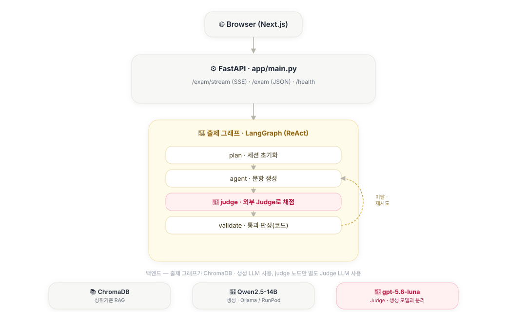
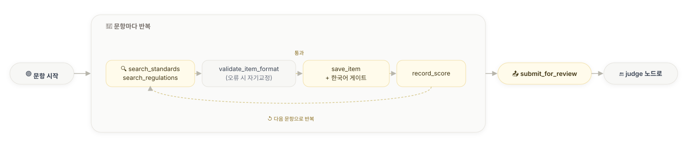
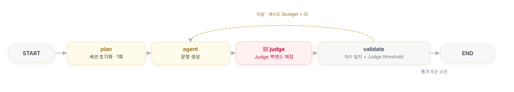
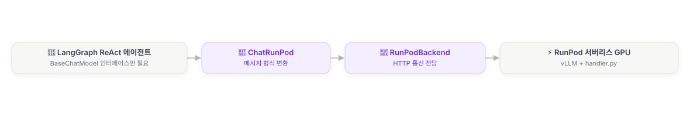
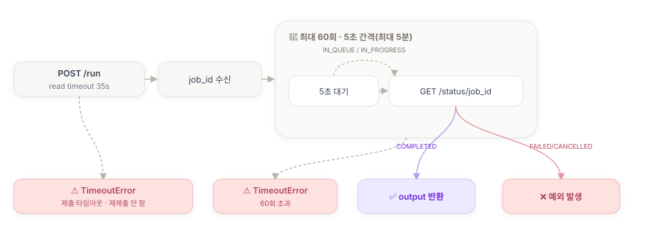
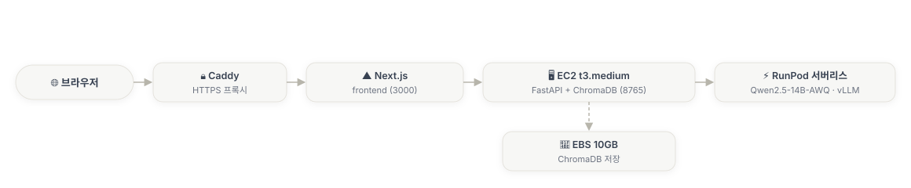

<div align="center">

# 분필 (bunpil)

**고등학교 사회 교사를 위한 AI 문항 출제 어시스턴트**


[한눈에 보기](#한눈에-보기) · [아키텍처](#아키텍처) · [설계 원칙](#설계-원칙) · [엔지니어링 하이라이트](#엔지니어링-하이라이트) · [품질 평가](#품질-평가) · [모델 선정](#모델-선정) · [빠른 시작](#빠른-시작-로컬) · [배포](#배포-프로덕션)

</div>

---

## 한눈에 보기

교사의 반복 업무 중 시간이 가장 많이 드는 **시험 문항 출제**를 소형 오픈소스 LLM(Qwen2.5-14B)으로 보조하는 서비스입니다. 예시 문제를 붙여넣으면 유형·난이도 구성이 유사한 새 문항 세트를 만들어 줍니다. 포트폴리오 프로젝트로, 지인 교사 1인이 실제 수업에 사용 중입니다 — 학생 개인정보가 애초에 개입하지 않는 구조라 실사용이 가능했습니다.

<details>
<summary><b>생기부 윤문 모듈을 왜 걷어냈는가 (2026-08-03, 펼치기)</b></summary>

원래 이 프로젝트는 **출제**와 **생기부 윤문** 두 모듈이었습니다. 생기부 모듈은 관찰 메모를 받아 PII를 마스킹하고 문체를 다듬은 뒤 기재 규정 위반을 검증하는 체인이었고, 규정 위반 Recall 0.927 / F1 0.962라는 수치도 있었습니다.

**그 수치의 근거를 추적하다 걷어냈습니다.** 검증 규칙(종교·정치성향, 외모, 추측 등 키워드 6종)이 어느 조항에서 나왔는지 확인하려고 교육부 기재요령 PDF **원문 262,678자를 전수 검색**했더니 `종교`·`신앙`·`외모`·`용모`·`추측`이 **한 번도 나오지 않았습니다**. 규칙의 실제 출처는 규정이 아니라 합성 골든셋의 라벨이었고, 그 골든셋으로 채점해 0.927이 나온 순환 구조였습니다.

더 결정적인 건 오작동 방향이었습니다 — 사회과가 가르치는 주제어를 그대로 막고 있었습니다:

| 결과 | 문장 |
|---|---|
| 🚫 차단 | 사회 수업에서 **정치적** 다원주의 개념을 조사해 발표함 |
| 🚫 차단 | **가정환경**에 따른 교육 격차를 주제로 보고서를 작성함 |
| ✅ 통과 | 아버지가 대기업 임원이라 경제에 관심이 많음 ← **기재요령 p24 위반** |

잡아야 할 건 놓치고 놓아줘야 할 건 잡았습니다. 하드룰 1(실제 학생 데이터 미사용) 때문에 합성 데이터로만 검증할 수 있어 실 현장 적용도 못 한 상태였고, 규칙의 옳고 그름을 판정해 줄 도메인 근거도 없었습니다. **검증할 수 없는 기능을 포트폴리오에 남기는 것보다 걷어내는 쪽이 정직하다고 판단**했습니다.

조사·측정 기록은 [EVAL.md](./EVAL.md) 14절에 남아 있고, 코드는 git 이력에 있습니다. PII 마스킹(`app/common/privacy.py`)은 출제 경로가 계속 사용하므로 골든셋 20건과 함께 유지됩니다.

</details>


| 입력 | 처리 | 출력 |
|---|---|---|
| 예시 문제 텍스트 붙여넣기 | PII 마스킹(모델 호출 **전**) → LangGraph ReAct 에이전트가 성취기준 RAG를 참조하며 생성 → **별도 Judge**가 구조 유사도 채점 → 코드가 통과 판정 → 미달 시 부족분만 이어서 재시도 | 지정 개수의 새 문항 세트 (예시와 유사한 유형·난이도 구성) |

### 시스템 구성도

<picture>
  <source media="(prefers-color-scheme: dark)" srcset="./assets/architecture-dark.svg">
  
</picture>

> 🎯로 표시한 **Judge LLM은 생성 LLM과 완전히 다른 백엔드**입니다 — 문항을 쓰는 모델이 자기 글을 자기가 채점하지 않도록 의도적으로 분리했습니다(배경은 [아키텍처](#아키텍처) 참고).

### 구현 현황

| 영역 | 상태 |
|---|---|
| 출제 모듈 (ReAct Agent, RAG, 자기교정 게이트) | ✅ 완료 |
| **생성 모델 ↔ Judge 모델 완전 분리** (2026-07-23) | ✅ 완료 |
| RAG (ChromaDB + BM25 하이브리드 + BGE-M3 + BGE-reranker) | ✅ 완료 |
| 평가 체계 (사람 라벨 골든셋 + LangSmith Experiments) | ✅ 완료 |
| 궤적 평가 (트레이스 집계 — 도구 실패 분포·재시도 원인) | ✅ 완료 — 현재 아키텍처 6세션 재측정(2026-08-04) |
| CI (GitHub Actions 경량 파이프라인) | ✅ 완료 |
| 배포 구성 (EC2 + RunPod 서버리스 + Caddy HTTPS) | ✅ 구성 완료 · ⏸️ RunPod는 현재 크레딧 소진으로 일시 중단 |
| 정답유일성(3.375/4.0) | ⬜ 미달 — **2026-08-07 타깃 전환**. 오답매력도는 현재 스택 재측정 결과 3.75로 목표 근접(추적하던 2.846은 7B 생성+qwen Judge 시절 값이라 무효였음). 진짜 병목은 정답유일성으로, 8건 중 3건이 **실제로 정답이 2개**인 문항이었다([EVAL.md](./EVAL.md) 22절) |
| 검색 골든셋 난이도 | ⬜ 기존 22건이 Recall@5 **1.000**으로 천장 도달 — 신규 10건(0.500) 편입 검토 중 |
| 코드 리뷰 전수 확인 | 🔄 진행 중 |

> 열린 항목의 상태·다음 행동은 [bunpil_roadmap.md](./bunpil_roadmap.md) "현재 열린 항목" 표에 정리돼 있습니다.

프로젝트의 특징 세 가지:

- **로컬 ↔ 프로덕션 전환 가능한 LLM 추상화** — 개발은 Ollama(로컬), 프로덕션은 RunPod 서버리스(vLLM). 환경변수 하나로 전환
- **"LLM이 판단하고, 코드가 결정한다"** — 품질·유사도 판단은 LLM에게, 통과/재시도/개수/언어 검증은 결정론적 코드에 ([설계 원칙](#설계-원칙))
- **평가 기반 개발** — 사람이 라벨링한 골든셋으로 검색·생성·마스킹 품질을 수치로 추적. 평가 체계 요약은 [EVAL_SUMMARY.md](./EVAL_SUMMARY.md), 회차별 raw 기록은 [EVAL.md](./EVAL.md), LangSmith Experiments 연동은 [LANGSMITH_GUIDE.md](./LANGSMITH_GUIDE.md), 삽질은 [TROUBLESHOOTING.md](./TROUBLESHOOTING.md)에 기록

---

## 아키텍처

| 구분 | 기술 |
|---|---|
| 백엔드 | FastAPI (비동기) |
| 프론트엔드 | Next.js (`frontend/`) |
| 에이전트 | LangGraph (ReAct) |
| RAG | ChromaDB + BGE-M3 임베딩 + **BM25 하이브리드(RRF 융합)** + BGE-reranker (모두 CPU) |
| 생성 LLM 서빙 | Ollama (개발) / RunPod 서버리스 vLLM (프로덕션) |
| Judge LLM | OpenAI gpt-5.6-luna(기본) / Ollama(대안) — 생성 백엔드와 독립 |
| 트레이싱 | LangSmith — 2026-07-24부터 PII 마스킹 후 프로덕션 API 서버에도 옵트인 트레이싱 허용(하드룰 3 예외) |
| 배포 | AWS EC2 t3.medium + EBS + RunPod 서버리스 + Caddy HTTPS |

### 출제 모듈 — ReAct 에이전트 + 분리된 Judge

에이전트(생성 LLM)가 추론과 문항 생성을 **직접** 담당하고, 도구 5개는 검색·저장·검증의 **순수 계산**만 수행합니다(도구 내부 LLM 호출 없음 — LLM을 도구 안에 중첩하는 안티패턴 제거). 구조 유사도 채점만은 도구가 아니라 그래프의 별도 `judge` 노드가 담당하며, 생성 모델과 **완전히 다른 LLM 백엔드**를 호출합니다.

| 도구 | 역할 |
|---|---|
| `search_standards` | 성취기준 RAG 검색 |
| `validate_item_format` | 선지 4개·①②③④ 형식 등 결정론적 형식 검증 (오류 시 수정 지침 반환 → 자기교정) |
| `save_item` | 문항 저장 — 한국어 오염 검사(한자 비율 ≥5% 또는 한글 부재 시 거부) + 예시 문제 그대로 베끼기 방지(bigram 포함률 ≥0.90 시 거부) + 세트 내 중복 방지(Jaccard ≥0.80 시 거부) 통과 시에만 저장 |
| `discard_item` | 승인 불가 문항을 ID로 폐기 |
| `submit_for_review` | 문항 세트 작성 완료 신호(인자 없음) — 이후 채점은 `judge` 노드가 수행 |

> **`search_regulations` 제거(2026-08-03)**: "교육과정 법령·지침을 검색한다"고 선언해 놓고 실제로는 `regulations` 컬렉션(= **생기부 문서 둘뿐**)을 조회하고 있었습니다. *"사회 문항 출제 시 유의사항"* 을 물으면 *"교외상은 기재할 수 없음"*, *"민주주의 문항 교육과정 준수"* 를 물으면 *"공직선거법에 따라 투표에 참가하는 경우 출석 인정 범위는…"* 이 돌아왔습니다. 문항 출제에 무관한 텍스트가 매번 컨텍스트에 주입된 셈입니다(궤적 eval에서 이 도구 호출 28건이 전부 `ok`로 집계). 교육과정은 `search_standards`가 이미 담당하므로 중복이자 오염원이라 제거했습니다.

<picture>
  <source media="(prefers-color-scheme: dark)" srcset="./assets/exam-loop-dark.svg">
  
</picture>

세트 전체는 LangGraph 그래프가 관리합니다. `agent`가 `submit_for_review`로 제출하면 `judge` 노드가 **생성 모델과 완전히 분리된 Judge 백엔드**(`get_judge_backend()`)로 구조 유사도를 채점하고, `validate` 노드가 코드로 판정(문항 개수 일치 + Judge 결과 threshold)합니다. 미달 시 최대 5회까지 `agent`로 재시도합니다 — 이때 **이미 만든 문항은 유지하고 부족분만 이어서 작성**합니다(부분 진행 보존).

<picture>
  <source media="(prefers-color-scheme: dark)" srcset="./assets/exam-graph-dark.svg">
  
</picture>

<details>
<summary><b>왜 <code>judge</code> 노드를 따로 뒀는가 (2026-07-23 변경, 펼치기)</b></summary>

원래는 `agent`가 `similarity_judge`라는 도구로 **자기 출력을 스스로 채점**했습니다(self-judge). 그런데 이 self-judge 신뢰도는 사람 라벨과 한 번도 대조된 적이 없었고, 정작 EVAL.md에 쌓아온 "구조 Judge 신뢰도" 수치는 전부 **오프라인** eval 스크립트(`get_judge_backend()` 재호출)를 측정한 것이었습니다 — 즉 "검증에 쓰는 Judge"와 "실제 배포된 judge"가 서로 다른 코드였습니다(검증-배포 불일치).

해결책은 self-judge의 신뢰도를 측정하는 게 아니라, **애초에 같은 judge를 검증·배포 양쪽에서 쓰는 것**이었습니다. `similarity_judge` 도구를 없애고 별도 `judge` 노드를 추가해, 런타임과 오프라인 eval(`evals/eval_lib.py`)이 `app/modules/exam/judge.py`의 `judge_structure()`를 그대로 공유하도록 통합했습니다. 이제 EVAL.md의 구조 Judge 신뢰도 수치가 곧 실제 배포된 judge의 신뢰도입니다.

**트레이드오프**: `JUDGE_BACKEND=openai`(기본값)에서는 매 문항 세트 생성마다 `passage_text`(PII는 마스킹되지만 저작권 있는 교사 지문일 수 있음)가 OpenAI로 전송됩니다. API 키가 없거나 호출이 실패하면 조용히 폴백하지 않고 그대로 실패합니다(fail-fast) — 신뢰도가 검증 안 된 채로 게이트를 통과시키는 문제를 반복하지 않기 위함입니다. 로컬로만 처리하려면 `JUDGE_BACKEND=local`.

</details>

### 입력 PII 마스킹

교사가 붙여넣은 예시 문제에 학생 이름·연락처가 섞여 들어올 수 있어, **모델 호출보다 먼저** 마스킹합니다(`app/main.py` `_build_spec()`). 마스킹된 텍스트만 에이전트·Judge·LangSmith로 흘러갑니다 — 그래서 프로덕션 트레이싱을 켤 수 있었습니다(하드룰 3 예외).

### API와 스트리밍

- **`POST /exam/stream`** (SSE) — UI가 사용하는 기본 경로. `graph.stream(stream_mode="updates")`로 LangGraph 노드 완료 시점마다 진행 이벤트를 전송합니다. POST 요청이라 브라우저 네이티브 `EventSource`(GET 전용) 대신 프론트엔드가 `fetch` + `ReadableStream`을 수동 파싱합니다.
- **`POST /exam`** (JSON 단발) — 동일 로직의 대안 엔드포인트 (curl 등 비-브라우저 클라이언트용)
- **`GET /health`** — 헬스체크 (인증 불필요)

```
data: {"status": "truncated", "msg": "입력이 길어 앞부분만 반영되었습니다."}  # 8,000자 초과 시만
data: {"status": "progress",  "msg": "준비 중..."}
data: {"status": "progress",  "msg": "AI가 문항을 생성하고 있습니다. 수 분 소요됩니다..."}
data: {"status": "progress",  "msg": "생성된 문항의 구조적 유사도를 채점하고 있습니다..."}
data: {"status": "progress",  "msg": "채점 결과가 기준을 통과했는지 확인하고 있습니다..."}
data: {"status": "progress",  "msg": "문항 세트를 다시 생성하고 있습니다 (2번째 시도)..."}  # 재시도(최대 5회)마다
data: {"status": "done",      "items": [...], "validation_passed": true, "truncated": false}
data: {"status": "error",     "msg": "요청을 처리하지 못했습니다."}  # 내부 상세는 노출하지 않음
```

<details>
<summary><b>동시성 설계 (펼치기)</b></summary>

- **요청 간 세션 격리**: 출제 요청별 컨텍스트를 `contextvars.ContextVar`로 분리. `asyncio.to_thread` + `contextvars.copy_context()`로 worker 스레드에 전파.
- **이벤트 루프 비블로킹**: `/exam`은 `asyncio.to_thread`로 LangGraph 실행. `/exam/stream`은 `graph.stream()`(동기 제너레이터)을 executor 스레드에서 돌리며 `asyncio.Queue`로 이벤트만 이벤트 루프에 전달.
- **동시 요청 제한**: `asyncio.Semaphore(2)`로 전역 동시 처리 슬롯을 2개로 제한(GPU 백엔드 과부하 방지). 슬롯 획득 실패(0.05초 타임아웃) 시 429 반환.

</details>

### LLM 백엔드 — ChatRunPod ↔ RunPodBackend

LangGraph 에이전트는 BaseChatModel 인터페이스만 알면 되고, RunPod과의 실제 HTTP 통신은 별도 레이어가 전담합니다. (Judge 백엔드는 이 경로를 타지 않는 별개 인터페이스 — `LLMBackend.generate()`, `app/common/llm/base.py`.)

<picture>
  <source media="(prefers-color-scheme: dark)" srcset="./assets/runpod-backend-dark.svg">
  
</picture>

RunPodBackend는 비동기 `/run`으로 작업을 한 번만 제출한 뒤 동일한 `job_id`를 폴링해, 긴 생성(멀티턴 ReAct)도 중복 실행 없이 안전하게 기다립니다.

<picture>
  <source media="(prefers-color-scheme: dark)" srcset="./assets/runpod-polling-dark.svg">
  
</picture>

> `/run` 제출 응답을 받지 못하면 job 자체는 이미 실행 중일 수 있으므로, 무작정 재제출하지 않고 명확한 예외로 상위 로직에 알립니다.

---

## 설계 원칙

**1. LLM이 판단하고, 코드가 결정한다.**
LLM의 자기 평가는 "기록"까지만 — 그것으로 무엇을 할지는 전부 결정론적 코드가 정합니다.

| 검증 대상 | 판단 주체 | 근거 |
|---|---|---|
| 구조 유사도 (유형·난이도) | 별도 Judge LLM (`judge` 노드) → threshold는 코드 | 정성 판단은 LLM이 낫고, 커트라인은 코드가 안정적 |
| 문항 개수 | 코드 (`len(items) == num_items`) | LLM Judge에 맡겼다가 설계 오류 발견 후 이관 |
| 언어 (한국어) | 코드 (`save_item` 한글 비율 게이트) | 중국어 오염 문항을 저장 전 차단 |
| 재시도 여부 | 코드 (budget 루프) | LLM에 재시도 판단을 맡기면 수량 제어가 깨짐 |

**2. 도구는 순수 계산만, Judge는 도구가 아니라 별도 노드.**
ReAct 도구 내부에 LLM 호출이 없습니다. 구조 유사도 채점은 그래프의 별도 `judge` 노드가 담당하며, 여기서만 생성 모델과 다른 LLM 백엔드를 호출합니다(왜 분리했는지는 [아키텍처](#출제-모듈--react-에이전트--분리된-judge) 참고).

**3. 보안 하드룰 (예외 없음).**
실제 학생 데이터 미사용(전부 합성/익명) · PII 마스킹은 모델 호출 **이전** · 사용자 입력(예시 문제) 비저장(요청 처리 중에만 메모리에 존재) · 로그·캐시에 PII 금지 · Next.js→FastAPI 서버 간 API 키 인증.

> **출력 보류는 하드룰에 걸리는 것만**(2026-08-03): PII 생성·잔존, 메모에 없는 사실 추가, 검증 시스템 실패. 규정 위반 판정(종교·정치·외모·가정환경 등 키워드 규칙과 LLM 판정)은 **경고로 강등**해 결과는 그대로 주고 교사가 판단합니다 — 키워드가 "학생 본인의 속성"과 "학생이 탐구한 주제"를 구분하지 못해 *"사회 수업에서 정치적 다원주의 개념을 조사해 발표함"* 같은 사회 교과 문장을 대량 오탐한 반면, 정작 규정이 금지하는 *"아버지가 대기업 임원이라…"* 는 놓쳤기 때문입니다([EVAL.md](./EVAL.md) 14절).

**4. 평가 기반 개발.**
골든셋은 코드에 하드코딩하지 않고 전부 `data/golden/*.json`으로 관리하며(파일별 용도는 [data/golden/README.md](./data/golden/README.md)), 모델·프롬프트 변경마다 [EVAL.md](./EVAL.md)에 결과 이력을 남깁니다.

---

## 엔지니어링 하이라이트

소형 오픈소스 LLM(7B, 이후 14B로 승격)으로 에이전트를 만들며 겪은 문제와 해결 과정입니다. 상세 진단 기록은 [TROUBLESHOOTING.md](./TROUBLESHOOTING.md) 참고.

| 문제 | 진단 | 해결 |
|---|---|---|
| 골든셋 생성 성공률이 ~37%에서 갑자기 **6%로 급락**, 모델이 중국어·스페인어 섞인 응답 | 로컬 Ollama가 `num_ctx` 기본값 **4096**으로 실행 중이었음(모델은 32K 지원). 멀티턴 ReAct + RAG 검색 결과 누적이 몇 턴 만에 한도를 초과 → 컨텍스트가 잘리며 시스템 프롬프트 유실. 동일 케이스 재현: 4096에서 0/5문항 → 16384에서 5/5문항 | `num_ctx=16384` 명시. vLLM(프로덕션)은 모델 네이티브 값을 쓰므로 **로컬 개발 환경에만 있던 설정 격차**였음 — dev/prod parity의 실례 |
| 생성 문항의 **45%에 중국어 오염** — "한국어로만 응답" 지시에도 발생 | LangSmith 트레이스 100건 정량 분석: 오염 출력의 입력 크기 중앙값 11,263자 vs 정상 8,009자 — 컨텍스트가 길수록 오염 확률이 오르는 **확률적 드리프트**. 오염 문항이 재시도 프롬프트에 실려 다음 시도로 전파되는 캐스케이드 경로도 확인 | `save_item`에 결정론적 한국어 게이트(한글 부재 또는 한자 비율 ≥5% 시 저장 거부 + 재작성 피드백). 기존 오염 사례 9건 소급 판정에서 수동 분류와 100% 일치 |
| "생성 개수 = 예시 문제 개수" 전제로 만든 count_match 검증이 실제 요구사항과 불일치 | 개수는 예시와 무관하게 사용자가 지정하는 값(`num_items`)이어야 함 — **골든셋 라벨링 직전에 설계 전제 자체가 틀렸음을 발견** | count_match를 LLM Judge에서 제거하고 `len(items)==num_items` 코드 검증으로 이관. 골든셋 전면 재생성 |
| 생성 프롬프트를 개선했는데 eval 수치가 **전혀 안 변함** | eval의 문항 품질 평가는 하드코딩된 고정 30문항을 채점하는 구조 — 생성 코드를 아무리 바꿔도 이 지표에 반영될 수 없었음 | 실제로 문항을 새로 생성해 채점하는 별도 검증 스크립트 작성. "eval이 존재하는가"와 "내 변경이 eval이 실제로 exercise하는 경로에 있는가"는 별개 |
| **검증-배포 불일치**: EVAL.md의 구조 Judge 신뢰도 수치는 몇 달간 `get_judge_backend()`(오프라인)를 측정한 것인데, 실제 런타임은 생성 모델 자신이 `similarity_judge` 도구로 자기 출력을 채점(self-judge)하고 있었음 | self-judge 신뢰도는 사람 라벨과 한 번도 대조된 적이 없었고, 도구 docstring 한 줄뿐인 루브릭 없는 프롬프트라 오프라인 Judge보다 신뢰도가 낮을 가능성이 높았음 — "검증한 것"과 "배포된 것"이 서로 다른 코드 경로였다는 뜻 | 생성 모델과 Judge 모델을 완전히 분리: `similarity_judge` 도구 제거, 별도 `judge` 노드가 `get_judge_backend()`로 채점(오프라인 eval과 동일 함수 공유) — 이제 EVAL.md 수치가 곧 배포된 judge의 신뢰도 |
| 재시도마다 이전 시도의 문항까지 전부 폐기 → num_items가 클수록 성공률 급락 | 재시도 구조가 세트 전체 재생성 방식이었음 | **부분 진행 보존**: 재시도 시 저장된 문항은 유지하고 "나머지 N개만 작성" 프롬프트로 이어서 생성. 개수 기준으로 적용 전 14건 중 부족 실패 8건 → 적용 후 6건 전부 목표 근접 달성(통제 실험은 아닌 생성 이력 기반 비교) |

---

## 품질 평가

> 지표 전체 목록·골든셋 현황·결과 이력은 [EVAL.md](./EVAL.md)에서 계속 갱신합니다. 아래는 **2026-07-24 정식 재측정치**(생성 Qwen2.5-14B / Judge gpt-5.6-luna — 현재 배포 구성과 동일, judge 분리(2026-07-23) 이후 런타임과 완전히 같은 코드로 처음 측정) 스냅샷입니다.

### 출제 모듈 — `evals/eval_exam.py`

| 지표 | n | 기준 | 실측 |
|---|---|---|---|
| 검색 Recall@5 | 22 | ≥ 0.80 | **1.000** ✅ (이전 0.955) |
| 검색 MRR | 22 | 참고값 | **0.854** (이전 0.789) |
| LLM Judge 종합평균 | 30 | ≥ 4.0 / 5 | **4.06** ✅ (첫 목표 달성, 이전 3.79) |
| Judge 신뢰도 (Cohen's κ) | 30 | ≥ 0.4 | **0.468** ✅ (첫 목표 달성, 이전 0.328) |
| Judge 신뢰도 (±1 일치율) | 30 | ≥ 0.7 | **0.700** ✅ |
| 구조 유사도 Judge — difficulty_match 일치율 | 45 | 참고값(게이트 없음) | 0.933 |
| 구조 유사도 Judge — overall MAE | 45 | 참고값(게이트 없음) | **0.644**(역대 최저, 이전 최고 0.850) |

- 검색 수치는 LLM과 무관한 BM25 + BGE-M3 + reranker 파이프라인 성능
- **검색 개선 2단(2026-08-03)** — Recall@5가 처음 1.000에 도달한 과정이 두 단계였고, **효과가 큰 쪽은 두 번째**였습니다:
  1. **하이브리드 검색**: dense 단독이던 검색에 BM25 어휘 검색을 더해 RRF로 융합. 새 모델·재인덱싱 없이 BGE-M3 토크나이저와 기존 청크 텍스트만 사용. 전체 MRR 0.789→0.814로 올랐지만 **원래 목표였던 regulations MRR(0.667)은 꿈쩍하지 않았습니다** — dense가 후보에조차 못 올리던 청크를 BM25가 찾아냈는데 리랭커가 top-5로 올리지 못했기 때문
  2. **`n_candidates` 20→10**: 리랭커를 조사하다 통념과 **반대** 결과를 만났습니다. 후보를 많이 줄수록 나빠집니다(10/20/30/50 → Recall@5 1.000/0.955/0.955/0.909). 리랭커가 후보가 늘수록 오답을 상위로 잘못 올리는 것으로 보입니다. 골든 22건 전수 대조에서 **개선 3건·악화 0건**, 리랭커가 채점할 쌍이 절반이라 **속도도 2배**
  - 최종: 전체 Recall@5 **1.000**·MRR **0.854**, regulations Recall@5 **1.000**·MRR **0.753**. 리랭커 ablation도 함께 측정해 "리랭커 기여도 미측정" 항목을 닫았습니다(MRR +0.034~0.045, Recall엔 영향 없음). 상세는 [EVAL.md](./EVAL.md) 12·13절
  - ⚠️ **Recall@5 1.000은 "이 22건에서 전부 찾았다"는 뜻**이지 검색이 완벽하다는 뜻이 아닙니다. 이제 이 골든셋으로는 추가 개선을 측정할 수 없어(천장 도달) 더 어려운 골든셋이 필요합니다
- 문항 품질·Judge 신뢰도가 이번에 나란히 첫 목표 달성 — Judge를 gpt-5.6-luna로 교체한 효과가 큼. 세부 항목 중 오답매력도가 3.40으로 낮게 나왔으나, 이는 **고정 골든셋(ITEM_GOLDEN) 채점값이라 우리 생성 품질이 아니다**(EVAL.md 9절). 현재 스택이 실제 생성한 문항으로 재측정한 값은 **3.75**이고, 진짜 병목은 **정답유일성 3.375**로 드러났다(EVAL.md 22절)
- 구조 유사도 Judge의 "overall 이진 κ ≥ 0.4" 게이트는 **2026-07-24 폐기 결정** — 몇 달간 0.000~0.178을 벗어나지 못했고, 이미 계산 중인 difficulty_match 일치율·overall MAE로 충분하다고 판단(계산 자체를 코드에서 제거, EVAL.md 1·6절)

### 입력 PII 마스킹 — `tests/test_masker.py`

| 지표 | n | 기준 | 실측 |
|---|---|---|---|
| PII 마스킹 누락률(FN) | 20 | = 0 | **0.000** ✅ |

- 규칙 기반이라 모델 크기와 무관하게 안정적. 골든셋 20건(PII 10 + 정상 10)을 유닛테스트가 직접 강제합니다
- NLI 사실추가율·규정 위반 Recall 둘 다 이번 측정에서 목표 달성. 다만 **이번엔 단일 실행 결과**(과거엔 3회 반복 평균으로 확인 — 규정 위반 Recall 과거 3회 평균은 0.927) — 상한 노이즈일 가능성이 있어 낙관적으로 해석하지 않는 게 안전함(EVAL.md 5절 참고)

### 궤적 평가 — `evals/eval_trajectory.py` (2026-08-03 신규)

위 두 스크립트가 **산출물**을 채점한다면, 이쪽은 **과정**을 본다. 골든셋 없이 LangSmith에
쌓인 트레이스를 집계해 도구 호출 실패 분포와 재시도 원인을 뽑는다(앱 코드 무변경 —
LangGraph가 자동으로 남기는 노드/도구 run만 읽음).

- **도구 호출을 `error` / `rejected` / `empty_result`로 분리** — `save_item`의 원문 복사
  게이트나 형식 검증 거부는 *가드레일이 의도대로 작동한 것*이지 실패가 아니다. 한 숫자로
  뭉치면 "에러율 31%"로 잘못 읽힌다
- **재시도 원인을 형식·절차 실패 vs Judge 판단 불일치 2축으로 분류** — `validate` 노드가
  이미 6종 문구로 라벨링하고 있어 별도 계측이 필요 없었다

**측정 결과 (2026-08-04, 세션 6건 · 도구 호출 91건)**

| 도구 | 거부율 | | 재시도 원인 | 건수 |
|---|---|---|---|---|
| `discard_item` | 0.636 | | `judgment`(Judge 점수 미달) | 11 |
| `save_item` | 0.625 | | `both` | 7 |
| `record_score` | 0.500 | | `format`(개수·형식) | **0** |
| `search_standards`·`submit_for_review`·`validate_item_format` | 0.000 | | | |

**개수·형식 게이트는 전부 통과하고 Judge 점수에서만 막힙니다.** 문항 품질 미달(2026-08-07 재측정 기준 정답유일성 3.375/4.0)이라는
알려진 열린 이슈와 방향이 일치해, 두 지표를 함께 추적하기로 했습니다.

<details>
<summary><b>이 측정에서 배운 것 — 같은 지표가 하루에 두 번 뒤집혔습니다 (펼치기)</b></summary>

**① 신·구 아키텍처가 한 통계에 섞여 있었다.** 첫 실행에서 2026-07-23 리팩터로 **제거된**
`similarity_judge` 호출이 잡혔습니다 → `--since` 옵션 추가.

**② "LangSmith 한도 소진"은 오진이었다.** 트레이스를 새로 만들려니 401이 떠서 한도 문제로
결론냈는데, 실제 원인은 `scripts/test_exam.py`에 **`load_dotenv()`가 없어 API 키가 아예
안 실린 것**이었습니다. ingest 엔드포인트에 직접 POST하니 202 Accepted가 돌아왔습니다.
"조회는 되는데 수집만 막힌다"는 관찰을 한도로 잘못 읽은 것이고, 실제로는 조회 스크립트만
`load_dotenv()`를 부르고 있었던 비대칭이었습니다. 덤으로 `--since`가 UTC 자정 기준이라
KST에서 오늘 오전 9시 이전 트레이스가 통째로 빠지는 버그도 같이 나왔습니다.

**③ 표본이 작으면 가설이 뒤집힌다.** 오염된 표본에서 `record_score` 거부율이 74%로 단독
최악이라 "item_id 혼동"을 후속 과제로 잡았는데, 깨끗한 6세션에서는 0.500으로 오히려
`save_item`(0.625)보다 **낮았습니다**. malformed tool-call도 "0건이라 해소됨"으로 적었다가
표본을 늘리니 18.4%로 다시 관측됐습니다. 두 가설 모두 기각했습니다.

상세는 [EVAL.md](./EVAL.md) 11·11.1절.

</details>

> ⚠️ **표본 6세션은 여전히 작습니다.** 방향성 신호로만 읽어야 하고, `test_exam.py`가
> `num_items=1`·`budget=2`인 스모크 조건이라 통과율 0.000을 프로덕션 실패율로 읽으면 안 됩니다.

<details>
<summary><b>기능 검증 결과 — test_*.py (펼치기)</b></summary>

| 레이어 | 스크립트 | 목적 | 실행 시점 |
|---|---|---|---|
| 기능 검증 | `test_*.py` | 파이프라인이 에러 없이 동작하는가 | 개발 중 수시 |
| 품질 평가 | `eval_exam.py` / `eval_ragas.py` | 얼마나 잘 하는가 (수치 지표) | 모델·프롬프트 변경 시 |
| 궤적 평가 | `eval_trajectory.py` | 그 결과에 어떻게 도달했는가 (실패 모드 분포) | 에이전트 구조 변경 시 |

| 테스트 | 항목 | 결과 |
|---|---|---|
| `test_rag.py` | PDF 파싱·청킹·임베딩·ChromaDB 저장/검색 | ✅ |
| `test_rag.py` | 검색 + BGE-reranker 재정렬 | ✅ |
| `test_llm.py` | Ollama 응답 수신 | ✅ |
| `test_llm.py` | local → RunPod 백엔드 전환 | ✅ |
| `test_exam.py` | passage_text → 에이전트 세트 생성 → judge 노드 채점 흐름 (그래프 무크래시, 도구 오류 자기수정) | ✅ |

</details>

<details>
<summary><b>프로덕션 검증 결과 — RunPod Qwen2.5, RTX A5000 (펼치기, 7B 기준 · 14B 승격 전 검증)</b></summary>

| 항목 | 결과 |
|---|---|
| 에이전트 tool calling (ChatRunPod → vLLM) | ✅ |
| 세트 출제 (save_item → judge 노드) | 리디자인 후 RunPod 재검증 필요 |
| validate_item_format 자기교정 루프 | ✅ |
| RAG 인덱싱 (규정·성취기준 2개 컬렉션) | ✅ regulations 510 / standards 573 청크 |
| EBS 영구 저장 | ✅ 컨테이너 재시작 후 재인덱싱 불필요 |
| 업로드 PDF 인덱싱 제거 | ✅ passage_text 붙여넣기로 인덱싱 자체가 불필요해짐 |
| 추론 속도 (세트) | 리디자인 후 재측정 필요 (구 수치: ~2–3분/1문항, RTX A5000, min workers=1) |

</details>

---

## 모델 선정

> 후보군 선정 기준·전체 비교 데이터·판단 근거는 [MODEL_SELECTION.md](./MODEL_SELECTION.md),
> raw 실험 데이터는 [EVAL.md](./EVAL.md) "7. 모델 비교 실험"·"7.1 budget=5 재검증"·"9. LangSmith
> Experiments" 절 참고. 아래는 결론만 요약.

**생성 모델 — Qwen2.5-14B 채택.** Qwen2.5-7B/14B·Llama3.1-8B·GPT-4o-mini·Qwen3.5-9B를
동일 15개 샘플·고정 Judge로 비교했다. 재시도 없는 조건(`budget=1`)에서는 GPT-4o-mini가
우세해 보였지만, 실제 서비스 조건(`budget=5`)으로 재검증하니 7B와 14B의 속도 격차가
사실상 사라졌고(258.8s vs 260.2s), 같은 속도에서 14B가 실패율(0% vs 6.7%)·개수
충족률(1.04 vs 0.65) 모두 뚜렷이 우수해 승격을 결정했다. GPT-4o-mini는 이 조건에서
실패율이 오히려 늘고(0%→13.3%) 과다생성 경향이 나타나 비용·외부 의존 트레이드오프까지
고려해 보류했다.

**Judge 모델 — gpt-5.6-luna 채택 (2026-07-21).** 로컬 Qwen 계열 Judge는 몇 달간
프롬프트를 튜닝해도 사람 라벨과의 신뢰도(Cohen's κ)가 목표(0.4)에 미달하는 상태가
지속됐다. 생성물을 고정하고 Judge만 qwen2.5:7b ↔ gpt-5.6-luna로 교체 비교한 결과
문항품질 κ 0.328→0.595, 구조유사도 overall MAE 1.689→0.600으로 개선돼 채택. 생성
모델은 비용·데이터 로컬 처리를 우선해 로컬 유지, Judge는 채점 신뢰도를 우선해 외부
모델로 분리한 결정이다(`JUDGE_BACKEND`로 생성 백엔드와 독립적으로 전환).

**Judge 아키텍처 — 런타임까지 완전 분리 (2026-07-23).** 처음 gpt-5.6-luna를 Judge로
정할 당시엔 `JUDGE_BACKEND`가 오프라인 eval 스크립트에만 영향을 줬다 — 런타임은
생성 에이전트 자신이 자기 출력을 스스로 채점했다(self-judge, 검증-배포 불일치. 자세한
배경은 [아키텍처](#출제-모듈--react-에이전트--분리된-judge)·[엔지니어링 하이라이트](#엔지니어링-하이라이트)
참고). 지금은 `JUDGE_BACKEND`가 **프로덕션 앱 실행에도 그대로 적용**되며, API 키가
없거나 호출이 실패하면 조용히 폴백하지 않고 그대로 실패한다(fail-fast).

---

## 빠른 시작 (로컬)

### 1. 환경 설정

```bash
git clone https://github.com/MachuEngine/bunpil.git
cd bunpil

python -m venv .venv
source .venv/bin/activate      # Windows: .venv\Scripts\activate
pip install -r requirements.txt

cp .env.example .env   # 필요 시 값 수정
```

### 2. Ollama 모델 설치

```bash
# Ollama 설치: https://ollama.com

# 생성 전용 (OLLAMA_MODEL)
ollama pull qwen2.5:14b

# Judge(기본 JUDGE_BACKEND=openai, gpt-5.6-luna)는 이제 앱 실행(judge 노드)에도 쓰임 —
# 기본값 그대로 쓰려면 .env에 OPENAI_API_KEY 필요. OpenAI 키 없이 로컬만으로 돌리려면
# .env에서 JUDGE_BACKEND=local로 바꿀 것(이 경우 위 qwen2.5:14b가 Judge로도 재사용됨,
# 별도 pull 불필요)

# 빠른 로직 테스트만 할 경우 (품질 낮음, 폴백 동작)
# ollama pull qwen2.5:1.5b
```

> **참고**: Ollama는 별도 설정이 없으면 `num_ctx`를 4096으로 제한합니다(모델 자체는 32K 지원). 멀티턴 ReAct 루프는 이를 몇 턴 만에 초과해 응답이 깨질 수 있어, `app/modules/exam/llm.py`에서 `num_ctx=16384`로 이미 올려뒀습니다 — 별도 조치 불필요. ([상세 기록](./TROUBLESHOOTING.md))

### 3. RAG 데이터 인덱싱

```bash
# data/ 경로에 PDF를 넣은 뒤 아래 순서대로 실행
.venv/bin/python scripts/index_regulations.py   # 생기부 기재요령·훈령 (검색 eval 전용)
.venv/bin/python scripts/index_standards.py     # 사회과 교육과정 성취기준
```

> 이미 적재된 파일은 자동 스킵 (idempotent). 처음 한 번만 실행하면 됩니다.

### 4. 서버 실행

터미널 3개를 사용합니다. `app/main.py`는 정적 파일을 서빙하지 않으므로, UI를 보려면 프론트엔드(Next.js)도 별도로 띄워야 합니다.

```bash
# 터미널 1 — Ollama LLM 서버
ollama serve

# 터미널 2 — FastAPI (API 전용, 포트 8765)
# JUDGE_BACKEND=local 지정 — 기본값(openai)은 judge 노드가 OPENAI_API_KEY를 요구하므로,
# 순수 로컬 테스트 시엔 명시적으로 local로 바꿔 Qwen을 Judge로도 재사용한다.
# Windows
$env:BUNPIL_API_KEY="replace_with_a_long_random_value"; $env:LLM_BACKEND="local"; $env:OLLAMA_MODEL="qwen2.5:14b"; $env:JUDGE_BACKEND="local"
.venv\Scripts\python.exe -m uvicorn app.main:app --host 127.0.0.1 --port 8765

# macOS / Linux
BUNPIL_API_KEY=replace_with_a_long_random_value LLM_BACKEND=local OLLAMA_MODEL=qwen2.5:14b JUDGE_BACKEND=local .venv/bin/python -m uvicorn app.main:app --host 127.0.0.1 --port 8765

# 터미널 3 — 프론트엔드 (Next.js, 포트 3000)
cd frontend
npm install    # 최초 1회
BUNPIL_API_KEY=replace_with_a_long_random_value BACKEND_URL=http://localhost:8765 npm run dev
```

브라우저에서 **http://localhost:3000** 접속(프론트엔드 포트 — `frontend/app/api/*/route.ts`가 `BACKEND_URL`로 FastAPI에 프록시). `BACKEND_URL` 미설정 시 기본값은 `http://localhost:8000`이라 위처럼 8765로 맞춰줘야 합니다.

---

## 배포 (프로덕션)

> **현재 상태(2026-07-22)**: RunPod 서버리스는 크레딧 소진으로 엔드포인트가 비활성 상태입니다. 아래는 정상 운영 시 아키텍처이며, 재개 시 크레딧 충전 + 엔드포인트 재생성만으로 복구 가능합니다(설정 자체는 유지됨).

<picture>
  <source media="(prefers-color-scheme: dark)" srcset="./assets/deploy-architecture-dark.svg">
  
</picture>

> **프론트엔드 배포**: `docker-compose.yml`의 `frontend` 서비스(`frontend/Dockerfile`, Next.js `output: "standalone"` 빌드)가 3000 포트로 UI를 서빙하고, `frontend/app/api/*/route.ts`가 컨테이너 내부에서 `BACKEND_URL=http://app:8765`로 FastAPI에 프록시합니다. Caddy는 3000만 바라보면 됩니다(아래 Caddyfile 참고). `docker compose up -d --build`로 `app`+`frontend`가 함께 뜹니다.

<details>
<summary><b>대안: 외부 호스팅(Vercel 등)에 frontend만 분리 배포 (펼치기)</b></summary>

지금 채택한 방식은 EC2 안에서 `frontend` 컨테이너를 상시 프로세스로 돌리는 방식(기존 인프라로 해결, 신규 계정 불필요)입니다. 대신 Next.js를 Vercel 등 외부 호스팅에 올리고 `BACKEND_URL` 환경변수만 EC2 도메인(`https://your-domain.com`)으로 맞추는 방식도 가능합니다 — 이 경우 `frontend` 컨테이너는 필요 없고, Caddy도 다시 FastAPI(8765)를 직접 바라보도록 되돌려야 합니다. CDN 엣지 배포로 프론트 응답이 더 빨라지는 대신 신규 외부 계정이 필요해 이 프로젝트에서는 채택하지 않았습니다.

</details>

### RunPod 서버리스 설정

```bash
# 1. 핸들러 이미지 빌드 & 푸시
cd runpod_handler
docker build -t <your-dockerhub>/bunpil-runpod:latest .
docker push <your-dockerhub>/bunpil-runpod:latest

# 2. RunPod 콘솔 → Serverless → New Endpoint → 이미지 URL 입력
# 3. 워커 설정: min workers=1 (콜드스타트 방지), max workers=4 (병렬 출제 시)
# 4. 발급된 Endpoint ID를 .env에 입력
# LLM_BACKEND=runpod
# RUNPOD_API_KEY=...
# RUNPOD_ENDPOINT_ID=...
```

### EC2 배포 (Docker Hub 이미지 사용)

```bash
# EC2 (Ubuntu 22.04 t3.medium) 내부에서
docker pull jongmin0826/bunpil-app:latest
docker pull jongmin0826/bunpil-frontend:latest

# EBS 볼륨 마운트 (처음 한 번)
sudo mkfs.ext4 /dev/nvme1n1
sudo mkdir -p /data/chroma_db
echo '/dev/nvme1n1 /data/chroma_db ext4 defaults,nofail 0 2' | sudo tee -a /etc/fstab
sudo mount -a

# app과 frontend가 컨테이너 이름으로 서로 통신할 수 있도록 전용 네트워크 생성
docker network create bunpil-net

# 컨테이너 실행 (FastAPI)
docker run -d --name bunpil \
  --network bunpil-net \
  -p 8765:8765 \
  --env-file /home/ubuntu/.env \
  -v /data/chroma_db:/data/chroma_db \
  jongmin0826/bunpil-app:latest

# 컨테이너 실행 (Next.js — BACKEND_URL은 컨테이너 이름으로 접근)
docker run -d --name bunpil-frontend \
  --network bunpil-net \
  -p 3000:3000 \
  -e BUNPIL_API_KEY='<FastAPI와 동일한 값>' \
  -e BACKEND_URL=http://bunpil:8765 \
  jongmin0826/bunpil-frontend:latest

# RAG 인덱싱 (처음 한 번 — EBS에 영구 저장됨)
docker exec bunpil python scripts/index_regulations.py
docker exec bunpil python scripts/index_standards.py
```

> `docker-compose.yml`을 그대로 쓰는 경우(`docker compose up -d --build`)는 네트워크 생성이 자동이라 위 `docker network create`/`--network` 단계가 필요 없습니다. Docker Hub에 `bunpil-frontend` 이미지를 아직 안 올렸다면 `cd frontend && docker build -t jongmin0826/bunpil-frontend:latest . && docker push ...`로 먼저 푸시해야 합니다.

### 빌링 알람

```bash
bash deploy/billing_alarm.sh   # 월 $10 초과 시 이메일 알람
```

### 월 운영비 (1인 기준)

| 항목 | 비용 |
|---|---|
| EC2 t3.medium | ~$30 |
| RunPod 서버리스 (추론만 과금, min workers=1) | ~$5–15 |
| EBS 10GB | ~$1 |
| **합계** | **~$36–46** |

데모/개발 중에는 EC2를 필요할 때만 켜서 절감 가능. min workers=0 설정 시 RunPod 비용 대폭 절감 (단, 콜드스타트 30–60초 발생).

---

## 데이터

| 컬렉션 | 경로 | 출처 | 용도 |
|---|---|---|---|
| `regulations` | `data/regulations/` | 학교생활기록부 종합지원포털 | **검색 eval 전용** — 생기부 모듈 제거(2026-08-03) 후 런타임에서는 조회하지 않으나, `retrieval_golden_final.json` 22건 중 10건이 이 컬렉션이라 Recall@5 히스토리 연속성을 위해 유지 |
| `standards` | `data/standards/` | 국가교육과정정보센터(NCIC) | 출제 시 성취기준 원문 검색 (`search_standards` 도구) |

> `past_exams` 컬렉션(수능·모평 기출)은 리디자인으로 완전히 제거됨 — `check_duplicate` 폐기, 2028 수능 개편으로 과목별 구조 자체가 무의미해짐.

## 디렉토리 구조

```
bunpil/
├── app/
│   ├── common/
│   │   ├── llm/          # LLM 추상화 (OllamaBackend / RunPodBackend / OpenAIBackend / ChatRunPod)
│   │   └── rag/          # PDF 파싱, 임베딩, 리랭킹, ChromaDB
│   ├── modules/
│   │   ├── exam/         # 출제 모듈 — graph.py(LangGraph) / tools.py(도구 7개) / judge.py(Judge 채점 함수)
│   └── main.py           # FastAPI (/exam/stream · /exam · /health)
├── frontend/             # Next.js UI
├── data/
│   ├── regulations/      # 생기부 기재요령·훈령 (검색 eval 전용 — 런타임 미사용)
│   ├── standards/        # 사회과 교육과정 PDF
│   └── golden/           # 골든셋 JSON — 정기 평가용 6종 + 실험 아카이브
│                         # (파일별 용도·라벨 필드는 data/golden/README.md 참고)
├── evals/                # 정기 품질 평가 — eval_exam.py / eval_ragas.py (+ 공용 eval_lib.py)
│                         # eval_trajectory.py는 산출물이 아닌 과정(궤적) 집계 — LangSmith 트레이스만 읽음
├── golden_gen/           # 골든셋 생성 도구 — gen_structure_golden.py / gen_golden_retrieval.py
├── experiments/          # 일회성 실험·비교 기록 (compare_*.py 등, 결과는 data/golden/_*.json에 아카이브)
├── scripts/
│   ├── index_*.py        # RAG 컬렉션 인덱싱
│   └── test_*.py         # 실제 로컬 모델로 파이프라인 배선 확인 (스모크 테스트)
├── runpod_handler/       # RunPod 서버리스 핸들러 (Qwen2.5-14B-AWQ vLLM)
├── deploy/               # EC2·Caddy·빌링알람 프로비저닝 스크립트
├── Dockerfile
├── docker-compose.yml
└── Caddyfile
```

## 환경변수

`.env.example` 참고. 시크릿은 `.env`에만 보관 — 커밋 금지.

| 변수 | 설명 | 기본값 |
|---|---|---|
| `BUNPIL_API_KEY` | Next.js → FastAPI 서버 간 인증 키(양쪽에 동일한 긴 무작위 값 설정) | 필수 |
| `LLM_BACKEND` | 생성 모델 백엔드 — `local`(Ollama) / `runpod` / `openai`(모델 비교 실험용) | `local` |
| `OLLAMA_MODEL` | 로컬 개발 생성 모델명 | `qwen2.5:14b` |
| `OLLAMA_BASE_URL` | 로컬 Ollama 서버 주소 | `http://localhost:11434` |
| `RUNPOD_API_KEY` | RunPod API 키 | — |
| `RUNPOD_ENDPOINT_ID` | RunPod 엔드포인트 ID | — |
| `JUDGE_BACKEND` | Judge 백엔드(생성 백엔드와 독립적으로 전환) — `local`(Ollama) / `openai`. **eval 스크립트와 프로덕션 앱 실행(judge 노드) 둘 다에 적용됨.** `openai`인데 키가 없거나 호출 실패 시 fail-fast | `openai` |
| `OLLAMA_JUDGE_MODEL` | `JUDGE_BACKEND=local`일 때 쓰는 로컬 Judge 모델명(미설정 시 `OLLAMA_MODEL` 폴백) | `qwen2.5:14b` |
| `OPENAI_API_KEY` | `LLM_BACKEND=openai` 또는 `JUDGE_BACKEND=openai`일 때 필요 | — |
| `OPENAI_MODEL` | 생성 모델 비교 실험용(`LLM_BACKEND=openai`일 때만) | `gpt-4o-mini` |
| `OPENAI_JUDGE_MODEL` | Judge 기본 모델(`JUDGE_BACKEND=openai`). 채택 근거는 [MODEL_SELECTION.md](./MODEL_SELECTION.md) | `gpt-5.6-luna` |
| `CHROMA_PERSIST_DIR` | ChromaDB 저장 경로 | `/data/chroma_db` (EC2) / `./chroma_db` (로컬) |
| `BGE_EMBED_MODEL` | 임베딩 모델명 | `BAAI/bge-m3` |
| `BGE_RERANK_MODEL` | 리랭킹 모델명 | `BAAI/bge-reranker-base` |
| `LANGCHAIN_TRACING_V2` | LangSmith 트레이싱 (`true` / `false`). 2026-07-24부터 프로덕션 API 서버에도 적용됨(PII 마스킹 후, 하드룰 3 예외) | `false` |
| `LANGCHAIN_API_KEY` | LangSmith API 키 | — (선택) |
| `LANGCHAIN_PROJECT` | LangSmith 프로젝트 베이스명 — 기본값('bunpil') 유지 시 `LLM_BACKEND`에 따라 `-dev`(local, 순수 로컬 개발) 또는 `-prod`(runpod/openai 등 실제 서빙 백엔드) 접미사가 자동으로 붙음(`app/common/llm/tracing.py`). 로컬 개발 노이즈가 프로덕션 통계를 오염시키지 않도록 분리. 'bunpil'이 아닌 값을 직접 설정하면 그대로 override | `bunpil` → `bunpil-dev` / `bunpil-prod` |
