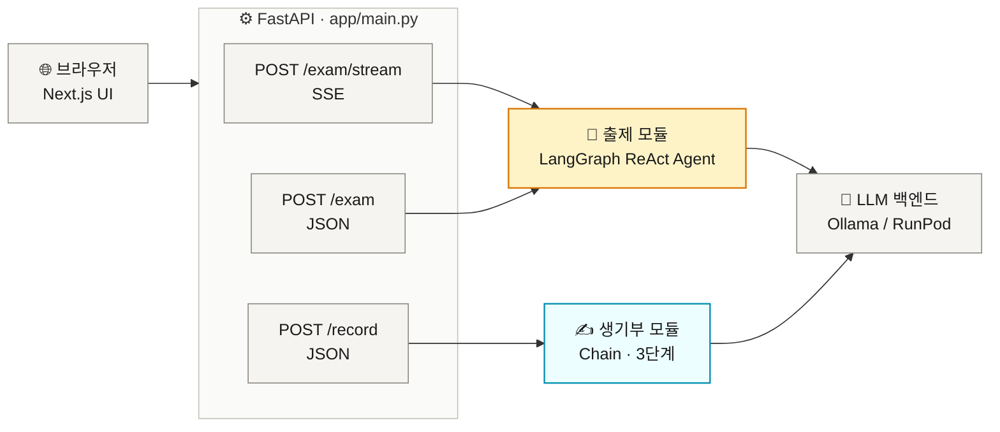
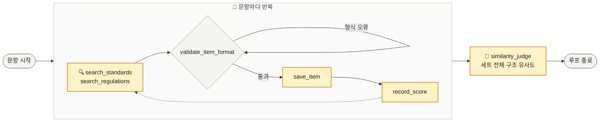
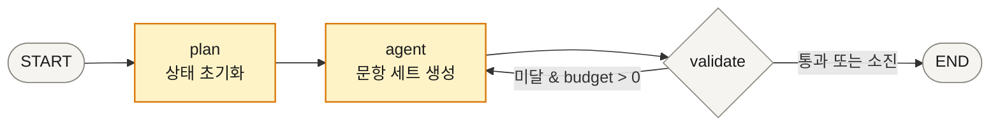
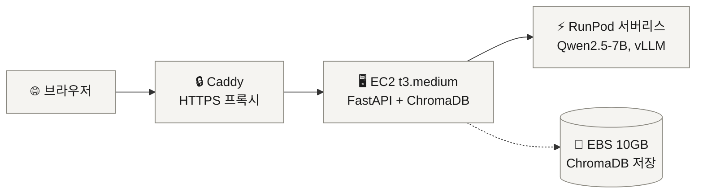

# 분필 (bunpil)

문제 생성과 생기부 작성에 도움을 주는 AI 어시스턴트

- **문항 출제** — 예시 문제 텍스트 붙여넣기 → 동일 구성(개수·유형·난이도)의 새 문항 세트 자동 출제
- **생기부 다듬기** — 교사 관찰 메모 → PII 마스킹 → 학교생활기록부 문체 교정 → 규정 위반 플래그

---

## 아키텍처



- **엔드포인트**: `/exam/stream`(SSE, UI 기본 경로) · `/exam`(JSON 단발, 대안) · `/record`(JSON 단발)
- **출제 모듈 도구**: `search_regulations`(법령 RAG) · `search_standards`(성취기준 RAG) · `validate_item_format`(형식 자기교정) · `save_item`(문항 저장) · `record_score`(자체 품질 평가) · `similarity_judge`(구조 유사도 평가) — `passage_text`(예시 문제 원문)를 받아 에이전트가 세트 전체를 한 번에 생성, 도구는 모두 순수 계산(내부 LLM 호출 없음)
- **생기부 모듈 체인**: `mask_pii`(regex, 모델 호출 전) → `polish`(Few-shot 문체 교정) → `validate`(규칙 + RAG 규정 검증)
- **LLM 백엔드**: 개발 환경은 생성·Judge 모두 `qwen2.5:7b`(Ollama) 동일 모델 사용 — `OLLAMA_JUDGE_MODEL`로 분리 가능(14B는 하드웨어 확보 후 별도 테스트 예정)

### ReAct 에이전트 설계 원칙

에이전트(LLM)가 추론과 문항 생성을 **직접** 담당합니다. 도구는 검색·저장·검증의 **순수 계산**만 수행하며 내부 LLM 호출이 없습니다. 이를 통해 도구 내부에 LLM을 중첩하는 안티패턴을 제거했습니다.



문항별 루프가 세트 전체에 대해 반복되다가 작성이 모두 끝나면 `similarity_judge`가 예시 문제와의 구조 유사도를 한 번만 평가하고, 호출 즉시 루프가 종료됩니다.

### 동시성 설계

- **요청 간 세션 격리**: 출제 요청별 컨텍스트를 `contextvars.ContextVar`로 분리. `asyncio.to_thread` + `contextvars.copy_context()`로 worker 스레드에 전파.
- **이벤트 루프 비블로킹**: `/exam`은 `asyncio.to_thread`로 LangGraph 실행. `/exam/stream`은 `graph.stream()`(동기 제너레이터)을 executor 스레드에서 돌리며 `asyncio.Queue`로 이벤트만 이벤트 루프에 전달. `/record`는 Chain 전체가 async이므로 `await chain.run()`으로 직접 호출.

### SSE 스트리밍

`/exam/stream`은 프론트엔드가 실제로 사용하는 기본 경로입니다. `graph.stream(stream_mode="updates")`로 LangGraph 노드(`plan`→`agent`→`validate`, 재시도 시 `agent`→`validate` 반복) 완료 시점마다 진행 이벤트를 `text/event-stream`으로 전달합니다. POST 요청이라 브라우저 네이티브 `EventSource`(GET 전용) 대신 프론트엔드에서 `fetch` + `ReadableStream`을 수동 파싱합니다.



`validate`는 `similarity_judge` 결과를 threshold로 판정합니다(미달 시 최대 5회까지 `agent`로 재시도). 노드가 완료될 때마다 아래처럼 진행 이벤트 하나씩 전송됩니다.

```
data: {"status": "truncated", "msg": "입력이 길어 앞부분만 반영되었습니다."}  # 8,000자 초과 시만
data: {"status": "progress",  "msg": "준비 중..."}
data: {"status": "progress",  "msg": "AI가 문항을 생성하고 있습니다. 수 분 소요됩니다..."}
data: {"status": "progress",  "msg": "생성된 문항의 구조적 유사도를 검증하고 있습니다..."}
data: {"status": "progress",  "msg": "문항 세트를 다시 생성하고 있습니다 (2번째 시도)..."}  # 검증 실패 시 재시도(최대 5회)마다 반복
data: {"status": "done",      "items": [...], "validation_passed": true, "truncated": false}
data: {"status": "error",     "msg": "...", "detail": "..."}  # 예외 발생 시
```

`/exam`은 동일 로직을 JSON 단발 응답으로 제공하는 대안 엔드포인트입니다(curl 등 비-브라우저 클라이언트용).

---

## 스택

| 구분 | 기술 |
|---|---|
| 백엔드 | FastAPI (비동기) |
| 프론트엔드 | Next.js (frontend/) |
| 에이전트 | LangGraph (ReAct) |
| 생기부 체인 | LangChain (수동 루프) |
| 벡터스토어 | ChromaDB |
| 임베딩 | BGE-M3 (CPU) |
| 리랭킹 | BGE-reranker-base (CPU) |
| LLM 서빙 | Ollama (개발) / RunPod vLLM (프로덕션) |
| 트레이싱 | LangSmith (선택, `LANGCHAIN_TRACING_V2=true` 시 자동 활성화) |
| 배포 | AWS EC2 t3.medium + EBS + RunPod 서버리스 + Caddy HTTPS |

---

## 빠른 시작 (로컬)

### 1. 환경 설정

```bash
git clone https://github.com/MachuEngine/bunpil.git
cd bunpil

python -m venv .venv
source .venv/bin/activate      # Windows: .venv\Scripts\activate
pip install -r requirements.txt

cp .env.example .env   # 필요 시 값 수정
```

### 2. Ollama 모델 설치

```bash
# Ollama 설치: https://ollama.com

# 생성 전용 (OLLAMA_MODEL)
ollama pull qwen2.5:7b

# Judge 전용 (OLLAMA_JUDGE_MODEL) — 현재는 생성 모델과 동일한 7B 사용, 별도 pull 불필요
# (14B는 하드웨어 확보 후 Judge 분리 테스트 예정)

# 빠른 로직 테스트만 할 경우 (품질 낮음, 폴백 동작)
# ollama pull qwen2.5:1.5b
```

### 3. RAG 데이터 인덱싱

```bash
# data/ 경로에 PDF를 넣은 뒤 아래 순서대로 실행
.venv/bin/python scripts/index_regulations.py   # 생기부 기재요령·훈령
.venv/bin/python scripts/index_standards.py     # 사회과 교육과정 성취기준
```

> 이미 적재된 파일은 자동 스킵 (idempotent). 처음 한 번만 실행하면 됩니다.

### 4. 서버 실행

터미널 2개를 사용합니다.

```bash
# 터미널 1 — Ollama LLM 서버
ollama serve

# 터미널 2 — FastAPI (UI + API 통합, 포트 8765)
# Windows
$env:LLM_BACKEND="local"; $env:OLLAMA_MODEL="qwen2.5:7b"
.venv\Scripts\python.exe -m uvicorn app.main:app --port 8765

# macOS / Linux
LLM_BACKEND=local OLLAMA_MODEL=qwen2.5:7b .venv/bin/python -m uvicorn app.main:app --port 8765
```

브라우저에서 **http://localhost:8765** 접속.

---

## 데이터

| 컬렉션 | 경로 | 출처 | 용도 |
|---|---|---|---|
| `regulations` | `data/regulations/` | 학교생활기록부 종합지원포털 | 생기부 규정 위반 검증 + 출제 시 교육과정 법령 참조 |
| `standards` | `data/standards/` | 국가교육과정정보센터(NCIC) | 출제 시 성취기준 원문 검색 (`search_standards` 도구) |

> `past_exams` 컬렉션(수능·모평 기출)은 리디자인으로 완전히 제거됨 — `check_duplicate` 폐기, 2028 수능 개편으로 과목별 구조 자체가 무의미해짐.

---

## 디렉토리 구조

```
bunpil/
├── app/
│   ├── common/
│   │   ├── llm/          # LLM 추상화 (OllamaBackend / RunPodBackend / ChatRunPod)
│   │   └── rag/          # PDF 파싱, 임베딩, 리랭킹, ChromaDB
│   ├── modules/
│   │   ├── exam/         # 출제 모듈 (LangGraph ReAct Agent, 6개 도구)
│   │   └── record/       # 생기부 모듈 (수동 루프 Chain)
│   └── main.py           # FastAPI (/exam/stream + /record)
├── frontend/             # Next.js UI
├── data/
│   ├── regulations/      # 생기부 기재요령, 작성·관리지침
│   ├── standards/        # 사회과 교육과정 PDF
│   └── golden/           # 검색·구조 평가 골든셋 (retrieval_golden_final.json, structure_golden.json)
├── scripts/
│   ├── index_regulations.py      # regulations 컬렉션 인덱싱
│   ├── index_standards.py        # standards 컬렉션 인덱싱
│   ├── gen_golden_retrieval.py   # 실제 컬렉션 기반 검색 골든셋 초안 생성
│   ├── test_llm.py               # LLM 추상화 레이어 검증
│   ├── test_rag.py               # RAG 파이프라인 검증
│   ├── test_exam.py              # 출제 모듈 통합 테스트 (passage_text 리디자인 반영)
│   ├── test_record.py            # 생기부 모듈 통합 테스트
│   ├── eval_exam.py              # 출제 평가 (Recall@5, MRR, LLM Judge, 구조 유사도 Judge 신뢰도)
│   └── eval_record.py            # 생기부 평가 (마스킹 FN, 사실추가율, 위반 Recall)
├── runpod_handler/       # RunPod 서버리스 핸들러 (Qwen2.5-7B vLLM)
├── deploy/               # EC2·Caddy·빌링알람 프로비저닝 스크립트
├── Dockerfile
├── docker-compose.yml
└── Caddyfile
```

---

## 검증

### 검증 구조

| 레이어 | 스크립트 | 목적 | 실행 시점 |
|---|---|---|---|
| 기능 검증 | `test_*.py` | 파이프라인이 에러 없이 동작하는가 | 개발 중 수시 |
| 품질 평가 | `eval_*.py` | 얼마나 잘 하는가 (수치 지표) | 모델 교체 시 |

### 현재 검증 환경

- **LLM**: `qwen2.5:7b` (Ollama 로컬) — 생성·Judge 모두 동일 모델
- **다음 단계**: 하드웨어 확보 후 `qwen2.5:14b`로 Judge 모델 분리 테스트 예정

### 기능 검증 결과 (qwen2.5:1.5b)

| 테스트 | 항목 | 결과 |
|---|---|---|
| `test_rag.py` | PDF 파싱·청킹·임베딩·ChromaDB 저장/검색 | ✅ |
| `test_rag.py` | 검색 + BGE-reranker 재정렬 | ✅ |
| `test_llm.py` | Ollama 응답 수신 | ✅ |
| `test_llm.py` | local → RunPod 백엔드 전환 | ✅ |
| `test_exam.py` | passage_text 입력 → 에이전트 세트 생성 → 저장 → similarity_judge 흐름(그래프 무크래시, 도구 오류 자기수정) | ✅ (1.5b는 지시 미준수로 문항 0개 생성 — 7B 이상에서 검증 필요) |
| `test_record.py` | PII 마스킹 4케이스 (전화번호·주민번호·학교명·이메일) | ✅ |
| `test_record.py` | 관찰 메모 → 생기부 문체 교정 | ✅ |
| `test_record.py` | 교사 책임 고지 출력 | ✅ |

> 1.5b 모델로 생성된 문항 품질(문장·정확도)은 낮을 수 있음. 파이프라인 로직 검증 목적.

### 품질 평가 지표

> 지표 전체 목록·골든셋 현황·결과 이력은 [EVAL.md](./EVAL.md)에서 계속 갱신합니다. 아래는 최신 스냅샷입니다.

**출제 모듈**

```bash
.venv/bin/python scripts/eval_exam.py
```

검색 평가는 실제 `standards` / `regulations` 컬렉션 기반 골든셋 22개 중 `reviewed: true` 21개(`data/golden/retrieval_golden_final.json`, past_exams 참조 8개 제거 후)를 사용합니다.

| 지표 | n | 기준 | 실측 |
|---|---|---|---|
| Recall@5 | 21 | ≥ 0.80 | 0.905 ✓ |
| MRR | 21 | 참고값 | 0.659 |
| 구조 유사도 Judge 신뢰도 (STRUCTURE_GOLDEN) | 3 | count/difficulty 일치율, overall MAE | count 0.667 / difficulty 0.667 / overall MAE 1.333 (1.5b, 부트스트랩 3개 기준 — 실제 모델 라벨 보강 필요) |
| LLM Judge 종합평균 | 30 | ≥ 4.0 / 5 | 3.68 ✗ (7B, 리디자인 이전 측정) |
| Judge 신뢰도 (Cohen's kappa) | 30 | ≥ 0.4 | 0.328 ✗ (7B) |
| Judge 신뢰도 (±1 일치율) | 30 | ≥ 0.7 | 0.800 ✓ (7B) |

> 검색 수치(Recall@5, MRR)는 LLM 모델과 무관하며 BGE-M3 + BGE-reranker 파이프라인 성능입니다. past_exams 제거 후 n이 28→21(reviewed 기준)로 줄면서 Recall@5가 0.679→0.905로 상승 — past_exams 항목이 상대적으로 검색 난도가 높았던 것으로 보입니다.
> LLM Judge/신뢰도 수치(3.68/0.328/0.800)는 리디자인 이전 7B 실측치 — ITEM_GOLDEN 기반 문항 품질 평가 자체는 이번 리디자인으로 바뀌지 않아 여전히 유효함. 미달 원인은 오답매력도(2.43/5)가 낮은 것 — 출제 프롬프트 튜닝 예정(로드맵 참고).
> 세트 제약(유형·난이도·중복률) 검증은 리디자인으로 폐기되고 구조 유사도 Judge 신뢰도 검증으로 대체됨. STRUCTURE_GOLDEN 3개는 Claude가 만든 합성 부트스트랩 데이터(실제 모델 생성 결과 아님, `data/golden/structure_golden.json`의 `_schema.provenance` 참고)로 eval 스캐폴딩 검증용 — 실제 모델(7B 이상) 출력 기반 라벨로 교체·보강 필요.

**생기부 모듈**

```bash
.venv/bin/python scripts/eval_record.py
```

| 지표 | n | 기준 | 7B 실측 |
|---|---|---|---|
| PII 마스킹 FN율 | 20 | = 0 | 0.000 ✓ |
| 키워드 사실추가율 | 20 | = 0 | 0.000 ✓ |
| NLI 사실추가율 | 20 | = 0 | 0.100 ✗ |
| 규정 위반 Recall | 50 | ≥ 0.95 | 0.840 ✗ |
| 규정 위반 F1 | 50 | 참고값 | 0.857 |

> PII 마스킹·키워드 검사는 규칙 기반이라 소형 모델에서도 안정적.
> NLI 사실추가율·규정 위반 Recall은 1.5b 대비 크게 개선(각각 0.7~0.9→0.1, 0.6→0.84)됐으나 아직 기준 미달 — 위반 탐지 프롬프트·규정 RAG 보강 예정(로드맵 참고). 수치는 qwen2.5:7b 기준.

### 프로덕션 검증 결과 (RunPod Qwen2.5-7B, RTX A5000)

| 항목 | 결과 |
|---|---|
| 에이전트 tool calling (ChatRunPod → vLLM) | ✅ |
| 세트 출제 (save_item → record_score → similarity_judge) | 리디자인 후 RunPod 재검증 필요 |
| validate_item_format 자기교정 루프 | ✅ |
| RAG 인덱싱 (규정·성취기준 2개 컬렉션) | ✅ regulations 510 / standards 573 청크 (past_exams 제거) |
| EBS 영구 저장 | ✅ 컨테이너 재시작 후 재인덱싱 불필요 |
| 업로드 PDF 인덱싱 제거 | ✅ passage_text 붙여넣기로 인덱싱 자체가 불필요해짐 |
| 추론 속도 (세트) | 리디자인 후 재측정 필요 (구 수치: ~2–3분/1문항, RTX A5000, min workers=1) |

---

## 보안 원칙

- 실제 학생 데이터 미사용 — 전부 합성/익명
- PII 마스킹은 모델 호출 **이전**에 수행
- 사용자 입력(메모·붙여넣은 예시 문제) **비저장** (요청 처리 중에만 메모리에 존재, 응답 후 폐기)
- 로그·캐시에 **PII 기록 금지**
- 생기부: 메모에 없는 사실 **추가 금지**. 출력에 교사 책임 고지 표시

---

## 배포 (프로덕션)



### RunPod 서버리스 설정

```bash
# 1. 핸들러 이미지 빌드 & 푸시
cd runpod_handler
docker build -t <your-dockerhub>/bunpil-runpod:latest .
docker push <your-dockerhub>/bunpil-runpod:latest

# 2. RunPod 콘솔 → Serverless → New Endpoint → 이미지 URL 입력
# 3. 워커 설정: min workers=1 (콜드스타트 방지), max workers=4 (병렬 출제 시)
# 4. 발급된 Endpoint ID를 .env에 입력
# LLM_BACKEND=runpod
# RUNPOD_API_KEY=...
# RUNPOD_ENDPOINT_ID=...
```

### EC2 배포 (Docker Hub 이미지 사용)

```bash
# EC2 (Ubuntu 22.04 t3.medium) 내부에서
docker pull jongmin0826/bunpil-app:latest

# EBS 볼륨 마운트 (처음 한 번)
sudo mkfs.ext4 /dev/nvme1n1
sudo mkdir -p /data/chroma_db
echo '/dev/nvme1n1 /data/chroma_db ext4 defaults,nofail 0 2' | sudo tee -a /etc/fstab
sudo mount -a

# 컨테이너 실행
docker run -d --name bunpil \
  -p 8765:8765 \
  --env-file /home/ubuntu/.env \
  -v /data/chroma_db:/data/chroma_db \
  jongmin0826/bunpil-app:latest

# RAG 인덱싱 (처음 한 번 — EBS에 영구 저장됨)
docker exec bunpil python scripts/index_regulations.py
docker exec bunpil python scripts/index_standards.py
```

### 빌링 알람

```bash
bash deploy/billing_alarm.sh   # 월 $10 초과 시 이메일 알람
```

---

## 환경변수

`.env.example` 참고. 시크릿은 `.env`에만 보관 — 커밋 금지.

| 변수 | 설명 | 기본값 |
|---|---|---|
| `LLM_BACKEND` | `local` 또는 `runpod` | `local` |
| `OLLAMA_MODEL` | 로컬 개발 모델명 | `qwen2.5:7b` |
| `RUNPOD_API_KEY` | RunPod API 키 | — |
| `RUNPOD_ENDPOINT_ID` | RunPod 엔드포인트 ID | — |
| `CHROMA_PERSIST_DIR` | ChromaDB 저장 경로 | `/data/chroma_db` (EC2) / `./chroma_db` (로컬) |
| `LANGCHAIN_TRACING_V2` | LangSmith 트레이싱 활성화 (`true` / `false`) | — (선택) |
| `LANGCHAIN_API_KEY` | LangSmith API 키 | — (선택) |
| `LANGCHAIN_PROJECT` | LangSmith 프로젝트명 | `bunpil` |

---

## 월 운영비 (1인 기준)

| 항목 | 비용 |
|---|---|
| EC2 t3.medium | ~$30 |
| RunPod 서버리스 (추론만 과금, min workers=1) | ~$5–15 |
| EBS 10GB | ~$1 |
| **합계** | **~$36–46** |

데모/개발 중에는 EC2를 필요할 때만 켜서 절감 가능. min workers=0으로 설정 시 RunPod 비용 대폭 절감 (단, 콜드스타트 30–60초 발생).
