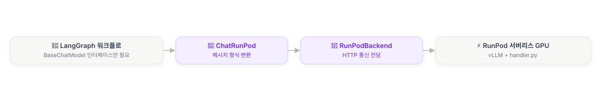

<div align="center">

# 분필 (bunpil)

**고등학교 사회 교사를 위한 AI 문항 출제 어시스턴트**


[한눈에 보기](#한눈에-보기) · [아키텍처](#아키텍처) · [설계 원칙](#설계-원칙) · [엔지니어링 하이라이트](#엔지니어링-하이라이트) · [모델 선정](#모델-선정) · [품질 평가](#품질-평가)

[빠른 시작](#빠른-시작-로컬) · [배포](#배포-프로덕션) · [데이터](#데이터) · [디렉토리 구조](#디렉토리-구조) · [환경변수](#환경변수)

</div>

---

## 한눈에 보기

교사의 반복 업무 중 시간이 가장 많이 드는 **시험 문항 출제**를 LLM으로 돕는 서비스입니다. 코드 기본값은 자체 호스팅한 Qwen2.5-14B이고, 2026-10 모델 재선정에서 gpt-6-luna를 평가 결론으로 선정했습니다(2026-10-07에 포트폴리오로 마무리하기로 결정해 운영 전환은 하지 않음). 예시 문제를 붙여넣으면 유형과 난이도 구성이 비슷한 새 문항 세트를 만들어 줍니다.

포트폴리오 프로젝트이지만 지인 교사 1인이 실제 수업에서 썼습니다. 학생 개인정보가 애초에 들어올 일이 없는 구조로 설계한 덕분에 실사용까지 갈 수 있었고, 그때 받은 교사 피드백은 2026-07 리디자인에 반영됐습니다. 지금은 포트폴리오로 마무리하며 서비스를 내린 상태입니다.


| 입력 | 처리 | 출력 |
|---|---|---|
| 예시 문제 텍스트 붙여넣기 | 개인정보 마스킹(모델 호출 **전**) → 에이전트가 문항을 생성 → **별도 채점 모델**이 예시와 얼마나 닮았는지 점수를 매김 → 코드가 통과 판정 → 미달이면 부족한 개수만 이어서 재시도 | 지정한 개수의 새 문항 세트 (예시와 유사한 유형·난이도 구성) |

처리 단계에 나오는 용어를 짧게 풀면 이렇습니다.

| 용어 | 뜻 |
|---|---|
| **PII 마스킹** | 학생 이름·연락처 같은 개인 식별 정보를 `[이름]` 형태로 가리는 것. PII는 개인정보를 뜻하고, 이 문서는 줄곧 "PII 마스킹"으로 부릅니다 |
| **성취기준** | 교육과정이 "이 단원에서 학생이 무엇을 할 수 있어야 하는가"를 문장으로 규정해 둔 것. 문항이 근거로 삼는 원문입니다 |
| **RAG** | 검색으로 근거 문서를 먼저 찾아 와서, 그 내용을 보고 생성하게 하는 방식 |
| **평가-수정 루프 워크플로** | 생성 → 채점 → 통과 판정 → 미달 시 재시도로 이어지는 전체 흐름. 분필에서는 이 흐름을 코드(LangGraph)가 고정해 둡니다 |
| **도구 호출 루프** | 그 흐름 중 생성 단계에서 LLM이 도구를 호출하고 결과를 확인한 뒤 다시 호출하기를 반복하며 스스로 진행하는 부분 |
| **Judge** | 생성된 문항에 점수를 매기는 별도 LLM. 문항을 쓴 모델과 다른 모델을 씁니다 |

### 시스템 구성도

<picture>
  <source media="(prefers-color-scheme: dark)" srcset="./assets/architecture-dark.svg">
  
</picture>

> 🎯로 표시한 **Judge LLM은 생성 LLM과 완전히 다른 백엔드**입니다 — 문항을 쓰는 모델이 자기 글을 자기가 채점하지 않도록 의도적으로 분리했습니다(배경은 [아키텍처](#아키텍처) 참고).
>
> ⚠️ 이 구성도는 ChromaDB(성취기준 RAG)를 출제 그래프가 쓰는 백엔드로 그리고 있지만,
> **2026-10-07부터 생성 경로에서 제외**돼 지금은 검색 평가용으로만 쓰입니다(아래
> "[RAG를 생성 경로에서 뺀 이유](#rag를-생성-경로에서-뺀-이유)" 참고). SVG 자체는 아직
> 갱신하지 않았습니다.

### 구현 현황

| 영역 | 상태 |
|---|---|
| 출제 모듈 (평가-수정 루프 워크플로, 자기교정 게이트) | ✅ 완료 |
| **생성 모델 ↔ Judge 모델 완전 분리** (2026-07-23) | ✅ 완료 |
| 검색(ChromaDB + BM25 하이브리드 + BGE-M3 + BGE 리랭커) | ✅ 완료 — ⛔ **2026-10-07부터 생성 경로에서 제외**, 검색 평가(Recall@5·MRR)용으로만 유지 |
| 평가 체계 (사람 라벨 골든셋 + LangSmith Experiments) | ✅ 완료 |
| 궤적 평가 (트레이스 집계 — 도구 실패 분포·재시도 원인) | ✅ 완료 — 현재 아키텍처 6세션 재측정(2026-08-04) |
| CI (GitHub Actions 경량 파이프라인) | ✅ 완료 |
| 배포 구성 (EC2 + RunPod 서버리스 + Caddy HTTPS) | ✅ 구성 완료 · ⏸️ 현재 내려 둠(EC2 삭제, RunPod 크레딧 소진) — `deploy/` 절차로 다시 띄울 수 있음 |
| 문항 품질 (오프라인 지표, 런타임 게이트 아님) | 🔄 사람 라벨 91건 기준 Judge κ(sonnet-5.5): 정답유일성 **0.86** 확정 · 오답매력도 **0.70** 확정 · 근거성 **0.56** 미확정 — 2026-10 생성 모델 재비교에서 gpt-6-luna를 평가 결론으로 선정(운영 전환은 하지 않음). 상세는 [품질 평가](#품질-평가) |
| 검색 골든셋 난이도 | ⬜ 기존 22건이 Recall@5 **1.000** [1.0, 1.0]으로 천장 도달 — 신규 10건(0.500) 편입 검토 중 |
| 코드 리뷰 전수 확인 | 🔄 진행 중 |

> 열린 항목의 상태·다음 행동은 [bunpil_roadmap.md](./bunpil_roadmap.md) "현재 열린 항목" 표에 정리돼 있습니다.

프로젝트의 특징 세 가지:

- **로컬 ↔ 프로덕션 전환 가능한 LLM 추상화** — 개발은 Ollama(로컬), 프로덕션은 RunPod 서버리스(vLLM). 환경변수 하나로 전환
- **"LLM이 판단하고, 코드가 결정한다"** — 품질과 유사도 판단은 LLM이 맡고, 통과 여부·재시도·개수·언어 검사는 결정론적 코드가 맡습니다 ([설계 원칙](#설계-원칙))
- **평가 기반 개발** — 사람이 라벨링한 골든셋으로 검색·생성·마스킹 품질을 수치로 추적

평가와 관련한 기록은 네 문서로 나눠 두었습니다.

| 문서 | 담는 내용 |
|---|---|
| [EVAL_SUMMARY.md](./EVAL_SUMMARY.md) | 평가 체계 요약 (지표 의미, 개선 스토리) |
| [EVAL.md](./EVAL.md) | 회차별 원본 기록 (시간순 실험 로그) |
| [LANGSMITH_GUIDE.md](./LANGSMITH_GUIDE.md) | LangSmith Experiments 연동 |
| [TROUBLESHOOTING.md](./TROUBLESHOOTING.md) | 삽질 기록 |

<!-- 제거된 모듈 배경: 제품 설명을 먼저 읽도록 섹션 끝으로 옮김 -->
<details>
<summary><b>생기부 윤문 모듈을 왜 걷어냈는가 (2026-08-03, 펼치기)</b></summary>

원래 이 프로젝트는 **출제**와 **생기부 윤문** 두 모듈이었습니다. 생기부 모듈은 관찰 메모를 받아 PII를 마스킹하고 문체를 다듬은 뒤 기재 규정 위반을 검증하는 체인이었고, 규정 위반 Recall 0.927 / F1 0.962라는 수치도 있었습니다.

**그 수치의 근거를 추적하다 걷어냈습니다.** 검증 규칙(종교·정치성향, 외모, 추측 등 키워드 6종)이 어느 조항에서 나왔는지 확인하려고 교육부 기재요령 PDF **원문 262,678자를 전수 검색**했더니 `종교`·`신앙`·`외모`·`용모`·`추측`이 **한 번도 나오지 않았습니다**. 규칙의 실제 출처는 규정이 아니라 합성 골든셋의 라벨이었고, 그 골든셋으로 채점해 0.927이 나온 순환 구조였습니다.

더 결정적인 건 오작동 방향이었습니다 — 사회과가 가르치는 주제어를 그대로 막고 있었습니다:

| 결과 | 문장 |
|---|---|
| 🚫 차단 | 사회 수업에서 **정치적** 다원주의 개념을 조사해 발표함 |
| 🚫 차단 | **가정환경**에 따른 교육 격차를 주제로 보고서를 작성함 |
| ✅ 통과 | 아버지가 대기업 임원이라 경제에 관심이 많음 ← **기재요령 p24 위반** |

잡아야 할 건 놓치고 놓아줘야 할 건 잡았습니다. [하드룰 1](#설계-원칙)(실제 학생 데이터 미사용) 때문에 합성 데이터로만 검증할 수 있어 실제 현장에 적용해 보지도 못한 상태였고, 규칙의 옳고 그름을 가려 줄 도메인 근거도 없었습니다. **검증할 수 없는 기능을 포트폴리오에 남기는 것보다 걷어내는 쪽이 정직하다고 판단**했습니다.

조사·측정 기록은 [EVAL.md](./EVAL.md) 14절에 남아 있고, 코드는 git 이력에 있습니다. PII 마스킹(`app/common/privacy.py`)은 출제 경로가 계속 사용하므로 골든셋 20건과 함께 유지됩니다.

</details>

---

## 아키텍처

| 구분 | 기술 |
|---|---|
| 백엔드 | FastAPI (비동기) |
| 프론트엔드 | Next.js (`frontend/`) |
| 에이전트 | LangGraph (평가-수정 루프 워크플로) |
| 검색(RAG, 생성 경로 미사용) | ChromaDB + BGE-M3 임베딩 + **BM25 하이브리드** + BGE 리랭커 (모두 CPU). 의미 기반 검색과 단어 기반 검색을 따로 돌린 뒤, 두 순위표를 RRF라는 표준 기법으로 하나로 합칩니다. **2026-10-07부터 `agent` 노드가 이 검색을 쓰지 않습니다** — 검색 평가(Recall@5·MRR)용으로만 유지합니다 |
| 생성 LLM 서빙 | Ollama (개발) / RunPod 서버리스 vLLM (프로덕션) |
| Judge LLM | 런타임 구조 게이트: OpenAI gpt-5.6-luna(기본) / Ollama(대안). claude-sonnet-5.5 교체는 2026-10 재선정 결론으로만 남기고 운영 전환은 하지 않음. 오프라인 정기 평가(2026-10부터): anthropic/claude-sonnet-5.5 — 모두 생성 백엔드와 독립 |
| 트레이싱 | LangSmith. 2026-07-24부터 PII 마스킹을 거친 뒤에 한해, 프로덕션 API 서버 기록도 켤 수 있게 열어 뒀습니다([하드룰 3](#설계-원칙) "사용자 입력 비저장"의 예외) |
| 배포 | AWS EC2 t3.medium + EBS + RunPod 서버리스 + Caddy HTTPS |

### 출제 모듈 — 평가-수정 루프 워크플로 + 분리된 Judge

분필을 "ReAct 에이전트"가 아니라 "LangGraph 평가-수정 루프 워크플로"로 부르는 건, LLM 판단에 맡기는 범위를 계속 줄여 온 이력과 맞추기 위해서입니다. 2026-07-23에 생성 모델이 자기 출력을 스스로 채점하던 self-judge 도구를 없애고 별도 `judge` 노드로 분리했고, 2026-08-06에는 self-judge의 흔적이던 `record_score` 도구까지 제거해 채점을 코드 밖 Judge LLM과 코드 게이트로 완전히 넘겼습니다. 지금 LLM이 스스로 반복하며 진행하는 부분은 `agent` 노드 안에서 도구를 호출해 문항을 쓰는 생성 단계뿐이고, `plan → agent → judge → validate → (미달 시) 재시도`라는 흐름 자체는 LangGraph가 코드로 고정합니다. 생성 단계에 도구 호출 루프를 남겨 둔 이유는 검증 결과(형식 오류·중복 등)를 도구 응답으로 즉시 돌려줘 모델이 같은 턴에서 고치게 하기 위해서이고, 그 대가로 인자가 깨진 도구 호출(malformed tool-call)이나 재시도 턴 한도 초과로 생성이 실패하는 경우가 있습니다([엔지니어링 하이라이트](#엔지니어링-하이라이트) 참고).

에이전트(생성 LLM)가 추론과 문항 생성을 **직접** 담당하고, 도구 4개는 저장·검증의 **순수 계산**만 수행합니다(도구 내부 LLM 호출 없음 — LLM을 도구 안에 중첩하는 안티패턴 제거). 구조 유사도 채점만은 도구가 아니라 그래프의 별도 `judge` 노드가 담당하며, 생성 모델과 **완전히 다른 LLM 백엔드**를 호출합니다.

| 도구 | 역할 |
|---|---|
| `validate_item_format` | 선지 4개·①②③④ 형식 등 결정론적 형식 검증 (오류 시 수정 지침 반환 → 자기교정) |
| `save_item` | 문항 저장 — 세 검사를 모두 통과해야 저장합니다. ① 한국어 오염(한자 비율 ≥5% 또는 한글 부재 시 거부) ② 예시 문제 베끼기(연속한 두 글자 묶음이 예시와 90% 이상 겹치면 거부) ③ 세트 내 중복(두 문항의 단어 집합이 80% 이상 겹치면 거부) |
| `discard_item` | 승인 불가 문항을 ID로 폐기 |
| `submit_for_review` | 문항 세트 작성 완료 신호(인자 없음) — 이후 채점은 `judge` 노드가 수행 |

> **`search_regulations` 제거(2026-08-03)**: "교육과정 법령·지침을 검색한다"고 선언해 놓고 실제로는 `regulations` 컬렉션(= **생기부 문서 둘뿐**)을 조회하고 있었습니다. *"사회 문항 출제 시 유의사항"* 을 물으면 *"교외상은 기재할 수 없음"*, *"민주주의 문항 교육과정 준수"* 를 물으면 *"공직선거법에 따라 투표에 참가하는 경우 출석 인정 범위는…"* 이 돌아왔습니다. 문항 출제에 무관한 텍스트가 매번 컨텍스트에 주입된 셈입니다(궤적 eval에서 이 도구 호출 28건이 전부 `ok`로 집계). 당시 교육과정은 `search_standards`가 담당하므로 중복이자 오염원이라 제거했습니다 — `search_standards` 자체도 이후 2026-10-07에 생성 경로에서 빠졌습니다(바로 아래 참고).

<picture>
  <source media="(prefers-color-scheme: dark)" srcset="./assets/exam-loop-dark.svg">
  
</picture>

> ⚠️ 이 흐름도는 `search_standards` 호출을 생성 루프의 첫 단계로 그리고 있지만,
> **2026-10-07부터 생성 경로에서 제외**돼 지금은 `validate_item_format`부터 시작합니다
> (아래 참고). SVG 자체는 아직 갱신하지 않았습니다.

### RAG를 생성 경로에서 뺀 이유

처음엔 "생성이 참고할 근거가 있어야 한다"는 생각으로 검색(ChromaDB + BGE-M3 + BM25
하이브리드 + 리랭커)을 구축했고, 하이브리드 전환으로 검색 자체의 Recall@5를
0.955→1.000까지 끌어올렸습니다([모델 선정](#모델-선정)). 그런데 검색이 실제로 생성
품질에 기여하는지는 한 번도 직접 떼어본 적이 없었습니다.

그래서 떼어봤습니다. 운영 생성 모델(gpt-6-luna)로 지문 33개를 검색을 켜고 끈 두
조건 × 2회 생성해 사람 수준 Judge(claude-sonnet-5.5)로 짝 비교했습니다
(`experiments/ablate_retrieval.py`). 정답유일성·오답매력도·근거성 차이는 전부
"판정 불가"(95% 신뢰구간이 0을 포함, 최대 0.07점 차이로 같은 조건의 반복 간 잡음과
비슷한 크기)였습니다. 검색이 실제로 하는 일은 문항의 `standard` 칸(화면의
"성취기준: ...")을 채우는 것뿐이었고(기재율 87% vs 0%), 그 코드 78개는 전부
코퍼스에 실재했지만 문항 품질과는 무관했습니다.

그 표시를 쓸 데가 있는지도 확인했습니다 — 사용자(지인 교사)는 이 표시를 쓰지
않습니다. 대안으로 "근거 확인 버튼"을 검토했지만 기각했습니다. 교육과정 문서(성취
기준·내용 요소)에는 지문에 등장하는 구체적 사실(예: 헌법재판소 권한 목록, 합성
자료의 통계 수치)이 없어 사실 확인 자체가 불가능하고, 쓰임새도 불확실했습니다.

**결정**: 생성 경로에서 RAG를 뺐습니다(`TOOLS` 5→4개, `standard` 필드·화면 표시
제거, 런타임이 더는 FlagEmbedding을 불러오지 않음). 검색 모듈·인덱스·검색 평가
(Recall@5·MRR)와 실험 재현용 `search_standards` 함수는 지우지 않고 유지했습니다 —
임베딩(BGE-M3)·리랭커(BGE-reranker) 선정도 이제 필요 없어졌습니다
([모델 선정](#모델-선정) MODEL_SELECTION.md §3~5). 부수적으로, 이 실험을 준비하며
로컬 벡터 DB 경로 문제로 검색이 실패해도 도구 오류 메시지로 삼켜져 드러나지 않는다는
것도 발견해 함께 고쳤습니다([엔지니어링 하이라이트](#엔지니어링-하이라이트) 참고).
상세 수치와 재현 명령은 [EVAL.md](./EVAL.md) 30절 참고.

세트 전체는 LangGraph 그래프가 관리합니다. `agent`가 `submit_for_review`로 제출하면 `judge` 노드가 **생성 모델과 완전히 분리된 Judge 백엔드**(`get_judge_backend()`)로 구조 유사도를 채점합니다. 그다음 `validate` 노드가 문항 개수가 맞는지, Judge 점수가 기준값(threshold)을 넘었는지를 코드로 판정합니다.

기준에 못 미치면 최대 5회까지 `agent`로 되돌아갑니다. 이때 **이미 만든 문항은 그대로 두고 부족한 개수만 이어서 작성**합니다(부분 진행 보존).

<picture>
  <source media="(prefers-color-scheme: dark)" srcset="./assets/exam-graph-dark.svg">
  
</picture>

<details>
<summary><b>왜 <code>judge</code> 노드를 따로 뒀는가 (2026-07-23 변경, 펼치기)</b></summary>

원래는 `agent`가 `similarity_judge`라는 도구로 **자기 출력을 스스로 채점**했습니다(self-judge). 그런데 이 self-judge의 신뢰도는 사람 라벨과 한 번도 대조된 적이 없었습니다.

정작 EVAL.md에 몇 달간 쌓아온 "구조 Judge 신뢰도" 수치는 전부 **오프라인** eval 스크립트(`get_judge_backend()` 재호출)를 잰 값이었습니다. "검증에 쓰는 Judge"와 "실제 배포된 Judge"가 서로 다른 코드였던 셈입니다(검증-배포 불일치).

해결책은 self-judge의 신뢰도를 측정하는 게 아니라, **애초에 같은 Judge를 검증과 배포 양쪽에서 쓰는 것**이었습니다. `similarity_judge` 도구를 없애고 별도 `judge` 노드를 추가해, 런타임과 오프라인 eval(`evals/eval_lib.py`)이 `app/modules/exam/judge.py`의 `judge_structure()`를 그대로 공유하도록 통합했습니다. 이제 EVAL.md의 구조 Judge 신뢰도 수치가 곧 실제 배포된 Judge의 신뢰도입니다.

**트레이드오프**: `JUDGE_BACKEND=openai`(기본값)에서는 문항 세트를 만들 때마다 `passage_text`가 OpenAI로 전송됩니다. PII는 마스킹되지만 저작권이 있는 교사 지문일 수 있습니다.

API 키가 없거나 호출이 실패하면 조용히 폴백하지 않고 그대로 실패합니다(fail-fast). 신뢰도가 검증되지 않은 Judge로 게이트를 통과시키는 문제를 반복하지 않기 위해서입니다. 전부 로컬에서 처리하려면 `JUDGE_BACKEND=local`로 바꾸면 됩니다.

</details>

### 입력 PII 마스킹

교사가 붙여넣은 예시 문제에 학생 이름·연락처가 섞여 들어올 수 있어, **모델 호출보다 먼저** 마스킹합니다(`app/main.py` `_build_spec()`). 마스킹된 텍스트만 에이전트와 Judge, LangSmith로 흘러갑니다. 그래서 프로덕션 트레이싱을 켤 수 있었습니다([하드룰 3](#설계-원칙)의 예외).

### API와 스트리밍

- **`POST /exam/stream`** (SSE) — UI가 사용하는 기본 경로. `graph.stream(stream_mode="updates")`로 LangGraph 노드 완료 시점마다 진행 이벤트를 전송합니다. POST 요청이라 브라우저 네이티브 `EventSource`(GET 전용) 대신 프론트엔드가 `fetch` + `ReadableStream`을 수동 파싱합니다.
- **`POST /exam`** (JSON 단발) — 같은 로직을 쓰는 대안 경로입니다. `curl`처럼 브라우저가 아닌 클라이언트를 위한 것입니다
- **`POST /exam/extract`** — 예시 문제 캡처 이미지(png/jpeg/webp, 5MB까지)를 받아 **VLM**(이미지를 읽는 LLM)으로 텍스트를 추출하고 마스킹해 반환합니다. 그래프와는 무관한 별도 경로이며, 추출된 텍스트를 `/exam/stream`에 그대로 넘기는 건 교사 몫입니다.
- **`POST /exam/explain`** — 생성된 문항 하나를 받아 정답 해설을 만듭니다. '해설 보기' 버튼을 누를 때만 호출합니다
  - 서버는 문항을 저장하지 않습니다. 브라우저가 다시 보내고, 서버는 모델 호출 전에 마스킹합니다(하드룰 2·3)
- **`GET /health`** — 서버가 살아 있는지만 확인합니다(인증 불필요)

문항 다운로드(학생용·교사용 PDF/TXT/PNG)는 서버를 거치지 않고 브라우저에서 만듭니다.

### 이미지로 예시 문제 입력하기

텍스트를 옮겨 적는 대신 화면 캡처를 붙여넣을 수 있습니다. 입력창에 이미지를 `Ctrl+V`로 붙여넣거나 "이미지 첨부" 버튼으로 파일을 고르면 VLM(기본 OpenAI, `VLM_BACKEND`)이 이미지를 읽어 텍스트로 옮깁니다. 발문과 `<보기>`, 선지는 원문 그대로 옮기고, 표·그래프·지도처럼 글자가 아닌 자료는 `[자료: ...]`로 풀어 씁니다.

추출된 텍스트는 입력창에 자동으로 채워지지만 생성이 바로 시작되지는 않습니다. 교사가 확인하고 고친 뒤 직접 "문항 생성"을 눌러야 합니다.

> ⚠️ **이 경로만 마스킹 순서가 다릅니다.**
>
> 다른 LLM 호출은 전부 개인정보 마스킹 뒤에 이뤄지지만, 여기서는 원본 이미지가 마스킹 전에
> VLM으로 먼저 갑니다. 이미지 자체를 마스킹할 방법이 없어, 텍스트로 뽑은 뒤에야 마스킹할 수
> 있기 때문입니다. **학생 개인정보가 찍힌 캡처는 넣지 마세요.**
>
> 이미지 원본은 디스크에 저장하지 않고 요청을 처리하는 동안에만 다룹니다(예외 범위와 트레이싱
> 차단 방식은 [DESIGN.md](./DESIGN.md) 6절).

> 정확도는 **CER**(글자 단위 오류율, 낮을수록 좋음)로 쟀습니다. 2026-10 재선정에서 모델을
> gpt-4o-mini에서 **gpt-6-luna**로 바꾸면서, 글자만 있는 문제는 0.010→0.000, 표·그래프가
> 낀 문제는 0.143→0.035로 줄었습니다(그림 90건+텍스트 20건, `evals/eval_vlm_compare.py`).
> 전환 근거는 [MODEL_SELECTION.md](./MODEL_SELECTION.md) §7 "2차 선정" 참고.

```
data: {"status": "truncated", "msg": "입력이 길어 앞부분만 반영되었습니다."}  # 8,000자 초과 시만
data: {"status": "format_notice", "msg": "예시의 OX 형식은 지원하지 않아 4지 선다 형식으로 만들었습니다."}  # 미지원 형식일 때만
data: {"status": "progress",  "msg": "준비 중..."}
data: {"status": "progress",  "msg": "AI가 문항을 생성하고 있습니다. 수 분 소요됩니다..."}
data: {"status": "progress",  "msg": "생성된 문항의 구조적 유사도를 채점하고 있습니다..."}
data: {"status": "progress",  "msg": "채점 결과가 기준을 통과했는지 확인하고 있습니다..."}
data: {"status": "progress",  "msg": "문항 세트를 다시 생성하고 있습니다 (2번째 시도)..."}  # 재시도(최대 5회)마다
data: {"status": "done",      "items": [...], "validation_passed": true, "truncated": false, "format_notice": ""}
data: {"status": "error",     "msg": "요청을 처리하지 못했습니다."}  # 내부 상세는 노출하지 않음
```

<details>
<summary><b>동시성 설계 (펼치기)</b></summary>

- **요청 간 세션 격리**: 출제 요청별 컨텍스트를 `contextvars.ContextVar`로 분리. `asyncio.to_thread` + `contextvars.copy_context()`로 worker 스레드에 전파.
- **이벤트 루프 비블로킹**: `/exam`은 `asyncio.to_thread`로 LangGraph 실행. `/exam/stream`은 `graph.stream()`(동기 제너레이터)을 executor 스레드에서 돌리며 `asyncio.Queue`로 이벤트만 이벤트 루프에 전달.
- **동시 요청 제한**: `asyncio.Semaphore(2)`로 전역 동시 처리 슬롯을 2개로 제한(GPU 백엔드 과부하 방지). 슬롯 획득 실패(0.05초 타임아웃) 시 429 반환.

</details>

### LLM 백엔드 — ChatRunPod ↔ RunPodBackend

LangGraph 에이전트는 BaseChatModel 인터페이스만 알면 되고, RunPod과의 실제 HTTP 통신은 별도 레이어가 전담합니다. (Judge 백엔드는 이 경로를 타지 않는 별개 인터페이스 — `LLMBackend.generate()`, `app/common/llm/base.py`.)

<picture>
  <source media="(prefers-color-scheme: dark)" srcset="./assets/runpod-backend-dark.svg">
  
</picture>

RunPodBackend는 비동기 `/run`으로 작업을 한 번만 제출한 뒤 동일한 `job_id`를 폴링해, 긴 생성(멀티턴 도구 호출 루프)도 중복 실행 없이 안전하게 기다립니다.

<picture>
  <source media="(prefers-color-scheme: dark)" srcset="./assets/runpod-polling-dark.svg">
  
</picture>

> `/run` 제출 응답을 받지 못하면 job 자체는 이미 실행 중일 수 있으므로, 무작정 재제출하지 않고 명확한 예외로 상위 로직에 알립니다.

---

## 설계 원칙

**1. LLM이 판단하고, 코드가 결정한다.**
LLM의 자기 채점은 "기록"까지만 쓰입니다. 그 값으로 무엇을 할지는 전부 결정론적 코드가 정합니다.

| 대상 | 누가 정하나 | 그렇게 나눈 이유 |
|---|---|---|
| 구조 유사도 (유형·난이도) | 점수는 별도 Judge LLM(`judge` 노드), 기준값은 코드 | 정성 판단은 LLM이 낫고, 합격선은 코드가 안정적 |
| 문항 개수 | 코드 (`len(items) == num_items`) | LLM Judge에 맡겼다가 설계 오류 발견 후 이관 |
| 언어 (한국어) | 코드 (`save_item` 한글 비율 게이트) | 중국어 오염 문항을 저장 전 차단 |
| 재시도 여부 | 코드 (`budget` 루프 — 재시도 허용 횟수) | LLM에 재시도 판단을 맡기면 수량 제어가 깨짐 |

**2. 도구는 순수 계산만, Judge는 도구가 아니라 별도 노드.**
도구 호출 루프의 도구 내부에는 LLM 호출이 없습니다. 구조 유사도 채점은 그래프의 별도 `judge` 노드가 담당하며, 여기서만 생성 모델과 다른 LLM 백엔드를 호출합니다(왜 분리했는지는 [아키텍처](#출제-모듈--평가-수정-루프-워크플로--분리된-judge) 참고).

**3. 보안 하드룰 (예외 없음).**
본문에서 "하드룰 N"으로 부르는 것이 아래 네 가지입니다.

| # | 하드룰 | 설명 |
|---|---|---|
| 1 | 실제 학생 데이터 미사용 | 골든셋을 포함해 전부 합성 또는 익명 데이터입니다 |
| 2 | PII 마스킹은 모델 호출 **이전** | 마스킹을 거치지 않은 텍스트는 어떤 모델에도 가지 않습니다 |
| 3 | 사용자 입력 비저장 | 예시 문제는 요청을 처리하는 동안 메모리에만 있습니다. 단 2026-07-24부터 마스킹을 거친 뒤의 LangSmith 트레이싱은 허용합니다 |
| 4 | 로그·캐시에 PII 금지 | 마스킹 전 원문은 어디에도 남기지 않습니다 |

여기에 더해 Next.js에서 FastAPI로 가는 서버 간 요청에는 API 키 인증을 겁니다.

**4. 평가 기반 개발.**
골든셋은 코드에 하드코딩하지 않고 전부 `data/golden/*.json`으로 관리합니다(파일별 용도는 [data/golden/README.md](./data/golden/README.md)). 모델이나 프롬프트를 바꿀 때마다 [EVAL.md](./EVAL.md)에 결과 이력을 남깁니다.

---

## 엔지니어링 하이라이트

소형 오픈소스 LLM(7B, 이후 14B로 승격)으로 출제 워크플로를 만들고, 2026-10에 평가 체계를 다시 세우며 겪은 문제와 해결 과정입니다. 상세 진단 기록은 [TROUBLESHOOTING.md](./TROUBLESHOOTING.md) 참고.

| 문제 | 진단 | 해결 |
|---|---|---|
| 골든셋 생성 성공률이 약 37%에서 갑자기 **6%로 급락**, 모델이 중국어·스페인어 섞인 응답 | 로컬 Ollama가 `num_ctx` 기본값 **4096**으로 실행 중이었음(모델은 32K 지원). 생성 단계의 멀티턴 도구 호출 루프(당시 ReAct로 부름) + RAG 검색 결과 누적이 몇 턴 만에 한도를 초과 → 컨텍스트가 잘리며 시스템 프롬프트 유실. 동일 케이스 재현: 4096에서 0/5문항 → 16384에서 5/5문항 | `num_ctx=16384` 명시. vLLM(프로덕션)은 모델 네이티브 값을 쓰므로 **로컬 개발 환경에만 있던 설정 격차**였음 — dev/prod parity의 실례 |
| 생성 문항의 **45%에 중국어 오염** — "한국어로만 응답" 지시에도 발생 | LangSmith 트레이스 100건 정량 분석: 오염 출력의 입력 크기 중앙값 11,263자 vs 정상 8,009자 — 입력이 길수록 오염 확률이 오르는 **확률적 현상**. 오염된 문항이 재시도 프롬프트에 그대로 실려 다음 시도까지 번지는 연쇄 경로도 확인 | `save_item`에 결정론적 한국어 게이트(한글 부재 또는 한자 비율 ≥5% 시 저장 거부 + 재작성 피드백). 기존 오염 사례 9건 소급 판정에서 수동 분류와 100% 일치 |
| "생성 개수 = 예시 문제 개수" 전제로 만든 count_match 검증이 실제 요구사항과 불일치 | 개수는 예시와 무관하게 사용자가 지정하는 값(`num_items`)이어야 함 — **골든셋 라벨링 직전에 설계 전제 자체가 틀렸음을 발견** | count_match를 LLM Judge에서 제거하고 `len(items)==num_items` 코드 검증으로 이관. 골든셋 전면 재생성 |
| 생성 프롬프트를 개선했는데 eval 수치가 **전혀 안 변함** | eval의 문항 품질 평가는 하드코딩된 고정 30문항을 채점하는 구조 — 생성 코드를 아무리 바꿔도 이 지표에 반영될 수 없었음 | 실제로 문항을 새로 생성해 채점하는 별도 검증 스크립트 작성. "eval이 있는가"와 "내가 바꾼 코드가 그 eval이 실제로 거쳐 가는 경로에 있는가"는 별개 |
| **검증-배포 불일치**: 몇 달간 쌓은 "구조 Judge 신뢰도"는 오프라인 `get_judge_backend()`를 잰 값인데, 런타임은 생성 모델이 `similarity_judge` 도구로 자기 출력을 채점(self-judge)하고 있었음 | self-judge는 사람 라벨과 대조된 적이 없고, 채점 기준(루브릭)도 함수 설명문 한 줄뿐이라 오프라인 Judge보다 신뢰도가 낮을 가능성이 높았음. "검증한 것"과 "배포된 것"이 다른 코드 경로였다는 뜻 | 생성 모델과 Judge를 완전 분리. `similarity_judge` 제거 후 별도 `judge` 노드가 오프라인 eval과 **같은 함수**로 채점 — EVAL.md 수치가 곧 배포된 Judge의 신뢰도 |
| 재시도마다 이전 시도의 문항까지 전부 폐기 → `num_items`가 클수록 성공률 급락 | 재시도 구조가 세트 전체 재생성 방식이었음 | **부분 진행 보존**: 재시도 시 저장된 문항은 유지하고 "나머지 N개만 작성" 프롬프트로 이어서 생성. 개수 기준으로 적용 전 14건 중 부족 실패 8건 → 적용 후 6건 전부 목표 근접 달성(통제 실험은 아닌 생성 이력 기반 비교) |
| 사전 점검에서 API 모델 2종이 **변별 지문 0/33** — 두 모델의 차이가 전혀 안 보임 | 당시 Judge(gpt-5.6-luna)가 대부분 4~5점을 줌. 사람 라벨 91건과 대조하니 오답매력도를 **+0.61점** 후하게 채점하고 있었음(근거성 +0.43). 이전 κ 0.468도 Claude가 합성한 라벨 30건 기준이었음 | 실제 생성 문항 95개에 사람 라벨(블라인드, 91건 채점)을 달아 Judge를 다시 고름. 오프라인 Judge를 claude-sonnet-5.5로 교체(정답유일성 κ 0.87 vs 0.78, 오답매력도 0.67 vs 0.53, 둘 다 짝지은 비교 CI가 0 미포함) |
| gpt-6-luna로 생성하면 일부 지문이 `400 No tool output found for function call`로 **통째로 실패** | 모델이 인자 JSON이 깨진 도구 호출을 내면 langchain-openai는 이를 `invalid_tool_calls`로 분리하지만, 다음 요청에는 다시 직렬화해 보냄. `agent_node`는 정상 `tool_calls`에만 응답해 "응답 없는 도구 호출"이 남았고 OpenAI 계열 API가 이를 거부함. Ollama는 관대해서 몇 달간 드러나지 않음 | `invalid_tool_calls`에도 오류 ToolMessage로 응답(노드 순서·재요청 흐름은 그대로). 실패했던 지문을 재실행해 400 없이 통과 확인, 회귀 테스트 추가 |
| 합답형·자료형 문항의 정답유일성을 Judge가 판단할 근거가 없음 | `judge_one()`이 Judge에게 발문·선지·정답만 보내고 `<보기>`·자료(stimulus)를 빠뜨림. 기존 골든셋 30건은 전부 `<보기>` 없는 단순 객관식이라 드러나지 않음 | stimulus가 있으면 Judge 입력에 포함(없는 문항은 기존과 같은 입력). 새 평가셋은 절반이 합답형·자료형 |
| main CI가 **2026-09-24부터 연속 실패** | `FlagEmbedding==1.2.11`이 내부에서 `peft`를 import하지만 의존성에 선언하지 않음. 로컬 `.venv`에는 우연히 설치돼 있어 로컬 테스트는 통과 | `requirements.txt`에 `peft==0.19.1` 고정. 새로 끌어오는 패키지 없음, CI 289개 통과 확인 |
| VLM 그림 서술 Judge 사람 라벨 90건이 **5점·1점에만 몰려** κ 0.95가 나왔음 — 중간 품질을 구분하는지는 검증된 적이 없었음 | 라벨 분포를 보니 2~3점이 0건. 핵심 수치 오류처럼 "중간 정도로 나쁜" 서술에도 Judge가 높은 점수를 줄 가능성을 이 데이터로는 배제할 수 없었음 | 결함 40건(핵심 수치 변경·단위 삭제 등)을 인공 주입해 중간 구간을 채움. 합산 130건에서 κ가 0.89로 내려갔고, **핵심 수치 오류를 약하게 보는 것**(사람 2.0점을 luna는 3.1점)을 발견해 품질 감시 경보 기준을 "3점 이하"로 다시 잡음 |
| `qwen3-vl:8b` 기본 태그로 VLM 추출을 돌리면 그림 61장 중 **25장이 빈 응답** | 이 태그는 생각(thinking) 버전이라, 출력 한도 2048토큰을 생각 과정에 다 써서 본문이 안 나옴(`think=false` 지정도 무시됨) | `qwen3-vl:8b-instruct`로 교체 — 추출에는 생각 과정이 필요 없음 |
| 검색 제거 실험(33세트) 내내 로컬 검색 백엔드가 **고장나 있었는데 드러나지 않음** | 로컬 `.env`의 `CHROMA_PERSIST_DIR`이 배포 경로(`/data`)라 `RAGStore` 초기화가 `OSError`로 실패했는데, `agent_node`가 도구 실행 예외를 메시지로만 돌려줘 로그에 남지 않았음 | 로컬 경로 자동 전환 헬퍼(`evals/local_env.py`)를 평가·실험 스크립트 16개에 적용, 도구 실행 예외를 이름·타입만 warning으로 로그, 생성 하네스에 세트별 `tool_errors` 집계 추가 |

---

## 모델 선정

> 후보군 선정 기준·전체 비교 데이터·판단 근거는 [MODEL_SELECTION.md](./MODEL_SELECTION.md),
> 실험 원본 데이터는 [EVAL.md](./EVAL.md) "7. 모델 비교 실험", "7.1 budget=5 재검증", "9. LangSmith
> Experiments" 절 참고. 아래는 결론만 요약.

**생성 모델 1차(2026-07) — Qwen2.5-14B 채택.** Qwen2.5-7B/14B, Llama3.1-8B, GPT-4o-mini, Qwen3.5-9B를
같은 샘플 15개와 고정 Judge로 비교했습니다. 여기서 `budget`은 재시도를 몇 번까지 허용하는지를 뜻합니다. 재시도가 없는 조건(`budget=1`)에서는
GPT-4o-mini가 우세해 보였지만, 실제 서비스 조건(`budget=5`)으로 재검증하자 7B와 14B의
속도 차이가 사실상 사라졌습니다(258.8초 vs 260.2초). 속도가 같다면 실패율(0% vs 6.7%)과
개수 충족률(1.04 vs 0.65)이 모두 뚜렷이 나은 14B를 쓸 이유가 분명해 승격했습니다.
GPT-4o-mini는 같은 조건에서 실패율이 오히려 늘고(0%→13.3%) 과다 생성 경향도 보여,
비용과 외부 의존 부담까지 함께 따져 보류했습니다. 당시 원칙은 "로컬 우선"(비용 0, 지문을
외부로 보내지 않음)이었습니다.

**생성 모델 2차(2026-10) — gpt-6-luna로 재선정, 운영 전환은 하지 않음.** 전제가 바뀌었습니다 —
RunPod 크레딧이 소진돼 운영 생성이 멈췄고, Judge는 이미 지문을 OpenAI로 보내고 있었습니다.
그래서 API 모델까지 운영 후보로 넣고 출제 품질과 운영 가능성 기준으로 다시 비교했습니다(API
호출은 OpenRouter로 통일). 같은 지문 33개로 qwen2.5:14b(로컬)·gpt-6-luna·gemini-3.8-flash를
돌린 결과, 로컬 qwen은 최종 게이트 통과율이 15.2%에 그쳤고 두 API 모델은 100%였습니다.
gpt-6-luna와 gemini-3.8-flash의 품질 차이는 대부분 통계적으로 "판정 불가"였지만, 교사에게
더 해로운 치명적 오류(정답이 틀리거나 근거가 없는 경우, ≤2점 비율)가 gpt-6-luna 쪽이
낮았고(유의하진 않음) 비용이 6.6배 저렴해(세트당 $0.0034 vs $0.0224) **운영 생성 모델을
gpt-6-luna로 재선정**했습니다. 단 교사 1인·하루 10세트 규모에서는 비용 차이(약 $0.03 vs
$0.22)가 결정적이지는 않습니다. **운영 전환(설정 교체·배포)은 하지 않기로 했습니다**
(2026-10-07). RunPod 크레딧 소진으로 운영 생성 자체가 멈춰 있는 데다, 분필은 포트폴리오로
마무리하기로 해서 이 재선정 결과는 평가 결론으로만 남깁니다.
비교표 전체와 통계 방법은 [MODEL_SELECTION.md](./MODEL_SELECTION.md) 2차 선정 절, 원자료는
[EVAL.md](./EVAL.md) 참고.

**Judge 모델 1차(2026-07-21) — gpt-5.6-luna 채택.** 로컬 Qwen 계열 Judge는 몇 달간 프롬프트를
손봐도 사람 라벨과의 신뢰도가 목표치를 넘지 못했습니다. 여기서 신뢰도는 **Cohen's 카파(κ)**로
쟀습니다. LLM이 매긴 점수와 사람이 매긴 점수가 얼마나 겹치는지를 0에서 1 사이로 나타낸 값이고,
0이면 찍은 것과 다를 바 없다는 뜻입니다. 이 프로젝트의 목표치는 0.4입니다.

생성물을 고정한 채 Judge만 qwen2.5:7b에서 gpt-5.6-luna로 바꿔 비교하자 문항 품질 κ가 0.328에서
0.595로 올랐고, 구조 유사도 **MAE**(평균 절대 오차, 사람 점수와 몇 점 차이 나는지)도 1.689에서
0.600으로 줄어 채택했습니다(단, 이 비교는 Claude가 합성한 고정 골든셋 30건 기준이었고
2026-10에 더 큰 표본으로 다시 쟀습니다 — 바로 아래 참고). 생성 모델은 비용과
데이터 로컬 처리를 우선해 로컬에 두고, Judge는 채점 신뢰도를 우선해 외부 모델로 분리한
결정입니다(`JUDGE_BACKEND`로 생성 백엔드와 따로 전환할 수 있습니다).

**Judge 모델 2차(2026-10) — 오프라인 평가는 sonnet-5.5로 교체, 런타임 게이트는 gpt-5.6-luna
유지.** Judge 후보 다섯(sonnet-5.5·opus-5.5·gpt-5.6-luna·gpt-6.1-sol·
gemini-3.8-flash)을 먼저 기존 구조 유사도 사람 라벨 45건으로 걸렀으나, 신뢰구간이 겹쳐 순위를
확정할 수 없었습니다. 점추정치와 비용·역할을 기준으로 sonnet-5.5와 gpt-5.6-luna(기존 운영
Judge) 두 후보로 좁혀 91건으로 다시 비교하자 sonnet-5.5의 κ가 세 기준 모두 더 높았습니다
(정답유일성 0.87 vs 0.78, 오답매력도 0.67 vs 0.53, 근거성 0.58 vs 0.54). 그래서 **오프라인
정기 평가 Judge를 sonnet-5.5로 교체**했습니다. 런타임 구조 게이트는 당장 gpt-5.6-luna를
유지합니다 — gpt-6-luna(운영 생성 후보)와 같은 계열이라는 우려는 33쌍 비교에서 뚜렷한
편향이 검출되지 않았지만 근거가 약해, 생성 모델과 계열이 다른 Judge를 처음부터 쓰기로 했기
때문입니다. sonnet-5.5로 같이 교체하는 건 2026-10-07 결정(운영 전환 미실시, 포트폴리오로
마무리)에 따라 평가 결론으로만 남깁니다. 상세는
[MODEL_SELECTION.md](./MODEL_SELECTION.md), 원자료는 [EVAL.md](./EVAL.md) 참고.

**Judge 아키텍처 — 런타임까지 완전 분리(2026-07-23).** gpt-5.6-luna를 Judge로 처음 정할
당시에는 `JUDGE_BACKEND`가 오프라인 eval 스크립트에만 적용됐습니다. 정작 런타임에서는
생성 에이전트가 자기 출력을 스스로 채점하고 있었습니다(self-judge, 검증-배포 불일치.
배경은 [아키텍처](#출제-모듈--평가-수정-루프-워크플로--분리된-judge), [엔지니어링 하이라이트](#엔지니어링-하이라이트) 참고).
지금은 `JUDGE_BACKEND`가 **프로덕션 앱 실행에도 그대로 적용**되며, API 키가 없거나 호출이
실패하면 조용히 폴백하지 않고 그대로 실패합니다(fail-fast).

**VLM 모델(이미지→텍스트) — gpt-4o-mini에서 gpt-6-luna로 재선정(2026-10).** 1차 선정
(2026-08)은 다른 모델과 비교 없이 gpt-4o-mini를 채택했습니다. 2026-10에 그림 서술
Judge를 먼저 사람 라벨 130건으로 검증한 뒤(가장 정확한 Judge가 gpt-5.6-luna로 κ 0.89 vs
sonnet-5.5 0.63, 문항 품질에서 더 정확했던 sonnet-5.5와 반대였습니다. 사람 점수가 양 끝에만 있던
첫 라벨 90건에서는 κ 0.95로 과대평가돼, 결함을 넣은 서술 40건으로 중간 구간을 채워 다시 쟀습니다.
luna는 핵심 수치 오류를 약하게 봐서 품질 감시 경보 기준은 3점 이하로 정했습니다) 후보 5종(API 3종·로컬 2종)을 비교하자 네 후보
모두 gpt-4o-mini보다 뚜렷이 우세했고, 그중 gpt-6-luna가 그림 문항 CER(0.035)과 서술
실패율(0%)에서 가장 좋았습니다. 운영 VLM을 gpt-6-luna로 재선정했고 1단계(코드 기본값
전환)는 적용했습니다. 로컬 qwen3-vl:8b-instruct로 옮겨 이미지 외부 전송(하드룰 2 예외)을
없애는 2단계는 운영 전환을 하지 않기로 해 더 검토하지 않습니다(이미지 외부 전송 예외를
없애는 방안으로 기록만 남깁니다). 비교 방법과 수치는 [MODEL_SELECTION.md](./MODEL_SELECTION.md) §7
"2차 선정", 원자료는 [EVAL.md](./EVAL.md) 29절 참고.

---

## 품질 평가

> **더 알고 싶으면 → [EVAL_SUMMARY.md §0 "이것만 기억하면 된다"](./EVAL_SUMMARY.md#0-이것만-기억하면-된다)** (1스크롤).
> 관리 지표는 50개지만 **합격선이 걸린 건 4개**뿐이고, 나머지는 게이트가 깨졌을 때 원인을 쪼개 보는 값입니다.
> 회차별 원본 로그는 [EVAL.md](./EVAL.md) — 시간순 실험 로그라 뒤 절이 앞 절을 뒤집는 곳이 있어, 어디가 그런지는 그 문서 0절에 색인해 뒀습니다.

아래 4개가 헤드라인입니다(2026-10-04 정기 평가 기준으로 갱신). **측정 조건이 행마다 다르니 세 번째 열을 같이 읽어 주세요.**

검색은 현재 배포 구성(RAG 파이프라인, LLM과 무관)에서 잰 값입니다. Judge 신뢰도와 생성 모델별
점수는 2026-10에 사람 라벨 91건(qwen2.5:14b·gpt-6-luna·gemini-3.8-flash 세 모델 × 지문
33개에서 뽑은 객관식 문항)으로 새로 측정했습니다. 날짜: 검색 2026-08-03, Judge 신뢰도·생성
모델 비교 2026-10-04.

| 지표 | 값 | 의미 |
|---|---|---|
| 검색 Recall@5 | **1.000** [1.0, 1.0] (MRR 0.854 [0.732, 0.955]) | RAG 파이프라인이 실제로 관련 문서를 찾아온다는 근거. n=22, 천장 도달 |
| Judge 신뢰도 (Cohen's κ, 오프라인 sonnet-5.5, 사람 라벨 91건) | 정답유일성 **0.86** [0.74,0.94] 확정 · 오답매력도 **0.70** [0.60,0.77] 확정 · 근거성 **0.56** [0.35,0.73] 미확정 | 오프라인 평가 Judge 채점이 사람 라벨과 일치한다는 근거. 아래 품질 점수들은 이 신뢰도에 기대어 읽어야 합니다 |
| 문항 품질(사람 채점) — 평가 결론상 선호 **gpt-6-luna** | 정답유일성/오답매력도/근거성 **4.55 / 3.76 / 4.79** (n=33) | 2026-10 생성 모델 2차 비교 결과. 운영 전환을 하지 않아 게이트 없는 참고값 |
| 〃 — 로컬 **qwen2.5:14b**(현재 기본값) | 정답유일성/오답매력도/근거성 **2.96 / 2.48 / 3.28** (n=25) | 같은 비교에서 API 두 모델에 모두 뚜렷이 뒤짐(신뢰구간이 0을 포함하지 않음) |

> **용어 세 가지만 먼저 풀어 둡니다.**
> **Recall@5**는 정답 문서가 검색 상위 5개 안에 들어온 비율입니다(1.000이면 전부 들어왔다는 뜻).
> **MRR**은 몇 번째로 올라왔는지까지 보는 값으로, 1위면 1점 2위면 0.5점 식으로 매긴 평균입니다.
> **Cohen's 카파(κ)**는 LLM 채점과 사람 채점이 얼마나 겹치는지를 0~1로 나타낸 값입니다. **신뢰구간(CI)**은
> "같은 측정을 반복하면 참값이 이 범위 안에 들어올 가능성이 크다"는 구간이고, 표에서는 `[하한, 상한]`으로
> 표기합니다. 아래 "확정/미확정/판정 불가"는 CI를 기준으로 가른 판정입니다 — **확정**은 목표 임계값을
> CI 하한까지 넘은 경우, **미확정**은 점추정치는 넘었지만 CI 하한이 임계값에 못 미치는 경우, **판정 불가**는
> CI가 0(또는 비교 대상)을 포함해 방향조차 가릴 수 없는 경우입니다.

> **옛 수치 0.468·4.06·3.14는 왜 사라졌나** — 셋 다 Claude가 문항과 점수를 모두 합성한 고정
> 골든셋(ITEM_GOLDEN, 30문항) 기준이었습니다. 0.468은 그 골든셋으로 잰 Judge 신뢰도(κ)인데
> 같은 Judge·같은 30건에서도 실행마다 0.468/0.595로 흔들렸고, 4.06은 그 골든셋 자체를 채점한
> 점수라 애초에 **생성 품질이 아니었습니다**(전/후 평균이 소수점까지 동일하게 나와서 발견 —
> [EVAL.md](./EVAL.md)). 3.14는 실제 생성물을 쟀지만 **qwen2.5:7b·budget=1·n=24**라는 작고
> 불리한 조건이었고, CI로 다시 계산하면 [2.74, 3.58]로 폭이 넓어 참고용이었습니다(옛 기록은
> 아래 상세 접기에 CI와 함께 남겨 뒀습니다). 2026-10부터 **실제 생성물(3모델) + 사람 라벨
> 91건**으로 측정 방식을 바꿔 위 표의 값으로 대체했습니다.

### 2026-10 모델 재선정 요약

| 구분 | 핵심 결과 |
|---|---|
| 생성 모델 3종 비교(33지문, 게이트는 런타임 Judge gpt-5.6-luna 기준) | 최종 게이트 통과율 qwen2.5:14b(로컬) 15.2% · gpt-6-luna 100% · gemini-3.8-flash 100%. 사람 점수(정답유일성/오답매력도/근거성) qwen 2.96/2.48/3.28(n=25) · gpt-6-luna 4.55/3.76/4.79(n=33) · gemini 4.33/4.15/4.39(n=33). 지연(중앙값) qwen 423초 · gpt-6-luna 32초 · gemini 37초. 세트당 비용(생성만) qwen $0 · gpt-6-luna $0.0034 · gemini $0.0224 |
| Judge 선정 | 오프라인 정기 평가 Judge를 sonnet-5.5로 교체(κ가 세 기준 모두 더 높음, [모델 선정](#모델-선정) 참고). 런타임 구조 게이트는 gpt-5.6-luna 유지. sonnet-5.5 교체는 운영 전환을 하지 않기로 해 평가 결론으로만 남김 |
| 결정 | 운영 생성 모델은 **gpt-6-luna**로 재선정. **운영 전환은 하지 않음(2026-10-07).** RunPod 크레딧 소진으로 운영 생성이 멈춰 있고, 분필은 포트폴리오로 마무리하기로 해 이 결과는 평가 결론으로만 남김 |
| 판정 기준 | 신뢰구간이 0(또는 비교 대상)을 포함하면 "판정 불가", 목표 임계값보다 신뢰구간 하한이 낮으면 "미확정", 그 외 "확정" |

상세 비교와 통계 방법은 [EVAL.md](./EVAL.md), 선정 근거는 [MODEL_SELECTION.md](./MODEL_SELECTION.md) 2차 선정 절 참고.

**한계**: 라벨러 1인(독립 라벨러 간 일치도 없음) · 합성 지문(실제 교사 입력 아님) · 객관식만(서술형
제외) · 학생 난이도 "상" 문항 0건(중·하 난이도에서의 비교) · VLM 그림 서술 골든셋 신규 75건은
Claude 합성 초안으로 사람 검수 전이고, Judge 검증에 쓴 결함 40건도 규칙 기반 인공 주입이라
실제 VLM 오류 분포와 다를 수 있음.

아래 접기 다섯 개에 근거를 나눠 담았습니다. 필요한 것만 펼쳐 보세요.

| 접기 | 무엇이 들어 있나 |
|---|---|
| 상세 지표 | 검색·Judge 신뢰도·구조 유사도·실측 생성 품질의 전체 수치 |
| 입력 PII 마스킹 | 하드 게이트 실측 (누락률 0) |
| 궤적 평가 상세 | 도구 거부율과 재시도 원인 분포 |
| 기능 검증 결과 | `test_*.py`가 무엇을 확인하는가 |
| 프로덕션 검증 결과 | RunPod 실환경 검증 (7B 시점 기록) |

<details>
<summary><b>상세 지표 — 검색·Judge 신뢰도·구조 유사도·실측 생성 품질 (펼치기)</b></summary>

### 출제 모듈 — `evals/eval_exam.py` (오프라인 Judge sonnet-5.5, 1회, 2026-10-04)

| 지표 | n | 기준 | 실측 |
|---|---|---|---|
| 검색 Recall@5 | 22 | ≥ 0.80 | **1.000** [1.0, 1.0] ✅ (천장 도달, 이전 0.955) |
| 검색 MRR | 22 | 참고값 | **0.854** [0.732, 0.955] (이전 0.789) |
| Judge 신뢰도(κ) — 정답유일성 | 91(사람 라벨) | ≥ 0.4 | **0.861** [0.738, 0.939] ✅ 확정 |
| Judge 신뢰도(κ) — 오답매력도 | 91 | ≥ 0.4 | **0.695** [0.599, 0.773] ✅ 확정 |
| Judge 신뢰도(κ) — 근거성 | 91 | ≥ 0.4 | **0.561** [0.347, 0.730] ⚠️ 미확정(CI 하한 0.347 < 0.4) |
| MAE(정답유일성/오답매력도/근거성) | 91 | 참고값 | 0.33 / 0.44 / 0.56 |
| 구조 유사도 Judge — difficulty_match 일치율 | 45 | 참고값(게이트 없음) | **0.867** [0.756, 0.956] |
| 구조 유사도 Judge — overall MAE | 45 | 참고값(게이트 없음) | **0.467** [0.311, 0.644] |

- 검색 수치는 LLM과 무관합니다. BM25 + BGE-M3 + 리랭커 파이프라인 자체의 성능입니다
- **검색 개선 2단(2026-08-03)** — Recall@5가 처음 1.000에 도달한 과정이 두 단계였고, **효과가 큰 쪽은 두 번째**였습니다:
  1. **하이브리드 검색**: 의미 기반 검색(dense)만 쓰던 것에 단어 기반 검색(BM25)을 더해 순위를 RRF로 합쳤습니다. 새 모델·재인덱싱 없이 BGE-M3 토크나이저와 기존 청크 텍스트만 사용. 전체 MRR 0.789→0.814로 올랐지만 **원래 목표였던 regulations MRR(0.667)은 꿈쩍하지 않았습니다** — dense가 후보에조차 못 올리던 청크를 BM25가 찾아냈는데 리랭커가 top-5로 올리지 못했기 때문
  2. **`n_candidates` 20→10**: 리랭커를 조사하다 통념과 **반대** 결과를 만났습니다. 후보를 많이 줄수록 나빠집니다(10/20/30/50 → Recall@5 1.000/0.955/0.955/0.909). 리랭커가 후보가 늘수록 오답을 상위로 잘못 올리는 것으로 보입니다. 골든 22건 전수 대조에서 **개선 3건·악화 0건**, 리랭커가 순위를 매길 쌍이 절반이라 **속도도 2배**
  - 최종: 전체 Recall@5 **1.000**·MRR **0.854**, regulations Recall@5 **1.000**·MRR **0.753**. 리랭커 ablation도 함께 측정해 "리랭커 기여도 미측정" 항목을 닫았습니다(MRR +0.034~0.045, Recall엔 영향 없음). 상세는 [EVAL.md](./EVAL.md) 12·13절
  - ⚠️ **Recall@5 1.000은 "이 22건에서 전부 찾았다"는 뜻**이지 검색이 완벽하다는 뜻이 아닙니다. 이제 이 골든셋으로는 추가 개선을 측정할 수 없어(천장 도달) 더 어려운 골든셋이 필요합니다
- **Judge 신뢰도 측정 방법이 2026-10에 바뀌었습니다.** 예전 κ 0.468(2026-07-24, n=30)은 Claude가
  문항과 점수를 모두 합성한 고정 골든셋(ITEM_GOLDEN) 기준이었고, 같은 Judge·같은 30건에서도
  실행마다 0.468/0.595로 흔들렸습니다. 지금은 **실제 생성물 + 사람 라벨 91건**(qwen2.5:14b·
  gpt-6-luna·gemini-3.8-flash 세 모델 × 지문 33개에서 뽑은 객관식 문항)으로 측정하고, 오프라인
  평가 Judge도 gpt-5.6-luna에서 sonnet-5.5로 교체했습니다(선정 근거는 [모델 선정](#모델-선정)).
  ITEM_GOLDEN 기준 κ·종합평균(0.468·4.06)은 폐기했습니다
- 생성물 기준 수치는 한동안 `experiments/`의 **일회성 A/B로만** 산발적으로 재 왔습니다. 오답매력도는 3.82였고, 정답유일성은 텍스트 지시가 통하지 않았습니다(p=0.58, 관찰된 차이가 우연일 가능성이 58%라 효과를 인정할 수 없다는 뜻). few-shot으로는 3.091에서 **3.875**까지 올랐지만 아직 미확정입니다 — 이 항목들은 모두 2026-09 이전, qwen2.5:7b 기준 기록입니다
- ⚠️ 위 값들은 표본도 조건도 제각각입니다. 2026-09-07 정기 관측치(오답매력도 3.29, 정답유일성
  2.67)는 아래 상세 접기에 CI와 함께 옛 기록으로 남겨 뒀고, 2026-10 모델 비교(위 헤드라인 표)가
  현재 기준입니다
- 오답매력도는 네 가지 개선 시도가 모두 무위로 끝나 **개선 수단 없음으로 종결**했습니다(EVAL.md 22·24~27절, 현재 상태는 [EVAL_SUMMARY.md](./EVAL_SUMMARY.md) §5)
- 구조 유사도 Judge의 "overall 이진 κ ≥ 0.4" 게이트는 **2026-07-24에 폐기**했습니다. 몇 달간 0.000~0.178을 벗어나지 못했고, 이미 계산 중이던 difficulty_match 일치율과 overall MAE로 충분하다고 판단해 계산 자체를 코드에서 지웠습니다(EVAL.md 1·6절)

### 실측 생성 품질 (옛 기록, 2026-09-07) — `evals/eval_ragas.py` (게이트 없음, 참고값)

> ⚠️ **이 절은 qwen2.5:7b·budget=1 시절의 옛 기록입니다.** 2026-10 모델 재비교(3모델·더 큰
> 표본, [위 헤드라인 표](#품질-평가)와 [모델 선정](#모델-선정) 참고)가 지금은 "우리 생성 품질"에
> 더 가까운 기준입니다. 여기는 CI를 덧붙여 참고용으로만 남겨 둡니다.

실제 그래프를 돌려 나온 문항을 `eval_exam.py`와 **같은 채점 함수**(`judge_one()`)로 채점합니다. 위 ITEM_GOLDEN 표와 지표 정의는 같고 **대상만 실제 생성물**입니다.

| 지표 | 실측 생성물 (n=24) | 참고: ITEM_GOLDEN (n=30) |
|---|---|---|
| 종합평균 | **3.14** [2.74, 3.58] | 4.06 |
| 정답유일성 | **2.67** (저품질 71%) | 4.40 |
| 오답매력도 | **3.29** (저품질 50%) | 3.50 |
| 근거성 | **3.46** (저품질 58%) | 4.57 |
| 합격률(≥4.0) | **29%** | 80% |

- ⚠️ **두 열을 직접 비교하지 마세요.** 모집단이 다르고(생성물 vs 합성 골든셋), 측정 조건도 다릅니다 — 왼쪽은 **qwen2.5:7b · budget=1**입니다. 지금은 ITEM_GOLDEN 자체를 폐기했고(위 품질 평가 서두 참고), 배포 후보도 2026-10 재선정으로 바뀌었습니다
- ⚠️ 24문항 중 **서술형 2건** 포함. `judge_one()`의 few-shot과 신뢰도 검증은 전부 객관식이라, 서술형은 Judge가 검증된 적 없는 입력 형식입니다(EVAL.md 8.1절 리뷰 지적)
- ⚠️ 2026-09-07 로컬 1회 실행값이고 **EVAL.md 회차 로그에는 아직 기록 전**입니다. n이 작고 회차 변동이 커서 게이트를 걸지 않았습니다
- 같은 실행의 RAG 품질은 Faithfulness **0.048** [0.0, 0.14](n=7, CI가 거의 전 구간을 덮을 만큼 넓음) · Answer Relevancy **0.374**로, 직전 기록(0.600 / 0.631)보다 크게 낮습니다. **원인 미규명** — 이 회차 전체를 신뢰하기 전에 확인이 필요합니다

</details>

<details>
<summary><b>입력 PII 마스킹 — <code>tests/test_masker.py</code> (펼치기)</b></summary>

| 지표 | n | 기준 | 실측 |
|---|---|---|---|
| PII 마스킹 누락률(FN) | 20 | = 0 | **0.000** ✅ |

- 규칙 기반이라 모델 크기와 무관하게 안정적. 골든셋 20건(PII 10 + 정상 10)을 유닛테스트가 직접 강제합니다

</details>

### 궤적 평가 — `evals/eval_trajectory.py` (2026-08-03 신규)

앞의 두 스크립트가 **산출물**을 채점한다면, 이쪽은 **과정**을 봅니다. 골든셋 없이 LangSmith에
쌓인 트레이스를 집계해 도구 호출 실패 분포와 재시도 원인을 뽑습니다. 앱 코드는 건드리지 않고
LangGraph가 자동으로 남기는 노드·도구 run만 읽습니다.

<details>
<summary><b>궤적 평가 상세 — 도구 거부율·재시도 원인 분포 (펼치기)</b></summary>

- **도구 호출을 `error` / `rejected` / `empty_result`로 분리** — `save_item`의 원문 복사
  게이트나 형식 검증 거부는 *가드레일이 의도대로 작동한 것*이지 실패가 아닙니다. 한 숫자로
  뭉치면 "에러율 31%"로 잘못 읽힙니다
- **재시도 원인을 형식·절차 실패와 Judge 판단 불일치 두 축으로 분류** — `validate` 노드가
  이미 6종 문구로 라벨링하고 있어 따로 계측할 필요가 없었습니다

**측정 결과 (2026-08-04, 세션 6건 · 도구 호출 91건)**

| 도구 | 거부율 | | 재시도 원인 | 건수 |
|---|---|---|---|---|
| `discard_item` | 0.636 | | `judgment`(Judge 점수 미달) | 11 |
| `save_item` | 0.625 | | `both` | 7 |
| `record_score`* | 0.500 | | `format`(개수·형식) | **0** |
| `search_standards`·`submit_for_review`·`validate_item_format` | 0.000 | | | |

\* `record_score`는 이후 리팩터로 제거된 도구입니다. 당시 트레이스에만 남아 있습니다.

**개수·형식 게이트는 전부 통과하고 Judge 점수에서만 막힙니다.** 문항 품질이 아직 목표에
못 미친다는 기존 이슈와 방향이 같아, 두 지표를 함께 추적하기로 했습니다.

<details>
<summary><b>이 측정에서 배운 것 — 같은 지표가 하루에 두 번 뒤집혔습니다 (펼치기)</b></summary>

**① 신·구 아키텍처가 한 통계에 섞여 있었습니다.** 첫 실행에서 2026-07-23 리팩터로 **제거된**
`similarity_judge` 호출이 잡혀, `--since` 옵션을 추가했습니다.

**② "LangSmith 한도 소진"은 오진이었습니다.** 트레이스를 새로 만들려니 401이 떠서 한도 문제로
결론냈는데, 실제 원인은 `scripts/test_exam.py`에 **`load_dotenv()`가 없어 API 키가 아예
안 실린 것**이었습니다. ingest 엔드포인트에 직접 POST하니 202 Accepted가 돌아왔습니다.
"조회는 되는데 수집만 막힌다"는 관찰을 한도로 잘못 읽은 것이고, 실제로는 조회 스크립트만
`load_dotenv()`를 부르고 있었던 비대칭이었습니다. 덤으로 `--since`가 UTC 자정 기준이라
KST에서 오늘 오전 9시 이전 트레이스가 통째로 빠지는 버그도 같이 나왔습니다.

**③ 표본이 작으면 가설이 뒤집힙니다.** 오염된 표본에서 `record_score` 거부율이 74%로 단독
최악이라 "item_id 혼동"을 후속 과제로 잡았는데, 깨끗한 6세션에서는 0.500으로 오히려
`save_item`(0.625)보다 **낮았습니다**. 형식이 깨진 도구 호출(malformed tool-call)도 "0건이라 해소됨"으로 적었다가
표본을 늘리니 18.4%로 다시 관측됐습니다. 두 가설 모두 기각했습니다.

상세는 [EVAL.md](./EVAL.md) 11·11.1절.

</details>

> ⚠️ **표본 6세션은 여전히 작습니다.** 방향성 신호로만 읽어야 하고, `test_exam.py`가
> `num_items=1`·`budget=2`인 스모크 조건이라 통과율 0.000을 프로덕션 실패율로 읽으면 안 됩니다.

</details>

<details>
<summary><b>기능 검증 결과 — test_*.py (펼치기)</b></summary>

| 레이어 | 스크립트 | 목적 | 실행 시점 |
|---|---|---|---|
| 기능 검증 | `test_*.py` | 파이프라인이 에러 없이 동작하는가 | 개발 중 수시 |
| 품질 평가 | `eval_exam.py` / `eval_ragas.py` | 얼마나 잘 하는가 (수치 지표) | 모델·프롬프트 변경 시 |
| 궤적 평가 | `eval_trajectory.py` | 그 결과에 어떻게 도달했는가 (실패 모드 분포) | 에이전트 구조 변경 시 |

| 테스트 | 항목 | 결과 |
|---|---|---|
| `test_rag.py` | PDF 파싱·청킹·임베딩·ChromaDB 저장/검색 | ✅ |
| `test_rag.py` | 검색 + BGE 리랭커 재정렬 | ✅ |
| `test_llm.py` | Ollama 응답 수신 | ✅ |
| `test_llm.py` | local → RunPod 백엔드 전환 | ✅ |
| `test_exam.py` | `passage_text` → 에이전트 세트 생성 → `judge` 노드 채점 흐름 (그래프 무크래시, 도구 오류 자기수정) | ✅ |
| `test_vlm.py` | PIL 합성 이미지 → `get_vlm_backend()` 실제 추출(2026-08-20) | ✅ |

</details>

<details>
<summary><b>프로덕션 검증 결과 — RunPod Qwen2.5, RTX A5000 (펼치기)</b></summary>

> ⚠️ **7B 시점의 기록입니다.** 14B 승격(2026-07) 전에 잰 값이고, RunPod은 2026-07-22부터
> 크레딧 소진으로 멈춰 있어 재검증하지 못했습니다. "재검증 필요"로 남은 두 항목이 그래서입니다.

| 항목 | 결과 |
|---|---|
| 에이전트 도구 호출(tool calling, ChatRunPod → vLLM) | ✅ |
| 세트 출제 (`save_item` → `judge` 노드) | 리디자인 후 RunPod 재검증 필요 |
| validate_item_format 자기교정 루프 | ✅ |
| RAG 인덱싱 (규정·성취기준 2개 컬렉션) | ✅ regulations 510 / standards 573 청크 |
| EBS 영구 저장 | ✅ 컨테이너 재시작 후 재인덱싱 불필요 |
| 업로드 PDF 인덱싱 제거 | ✅ passage_text 붙여넣기로 인덱싱 자체가 불필요해짐 |
| 추론 속도 (세트) | 리디자인 후 재측정 필요 (옛 수치: 문항 1개당 약 2~3분, RTX A5000, `min workers=1`) |

</details>

---

## 빠른 시작 (로컬)

### 1. 환경 설정

```bash
git clone https://github.com/MachuEngine/bunpil.git
cd bunpil

python -m venv .venv
source .venv/bin/activate      # Windows: .venv\Scripts\activate
pip install -r requirements.txt

cp .env.example .env   # 필요 시 값 수정
```

### 2. Ollama 모델 설치

```bash
# Ollama 설치: https://ollama.com

# 생성 모델 (OLLAMA_MODEL)
ollama pull qwen2.5:14b

# 로직만 빠르게 확인할 때 (품질은 낮음)
# ollama pull qwen2.5:1.5b
```

**Judge 모델은 따로 받을 필요가 없습니다.** 기본값(`JUDGE_BACKEND=openai`, gpt-5.6-luna)은
`judge` 노드가 앱 실행 중에도 호출하므로 `.env`에 `OPENAI_API_KEY`만 넣으면 됩니다.
OpenAI 키 없이 로컬만으로 돌리려면 `.env`에서 `JUDGE_BACKEND=local`로 바꾸세요. 위에서 받은
`qwen2.5:14b`가 Judge로도 재사용됩니다.

> **참고**: Ollama는 별도 설정이 없으면 `num_ctx`를 4096으로 제한합니다(모델 자체는 32K 지원). 생성 단계의 멀티턴 도구 호출 루프는 이를 몇 턴 만에 초과해 응답이 깨질 수 있어, `app/modules/exam/llm.py`에서 `num_ctx=16384`로 이미 올려뒀습니다 — 별도 조치 불필요. ([상세 기록](./TROUBLESHOOTING.md))

### 3. RAG 데이터 인덱싱

```bash
# data/ 경로에 PDF를 넣은 뒤 아래 순서대로 실행
.venv/bin/python scripts/index_regulations.py   # 생기부 기재요령·훈령 (검색 eval 전용)
.venv/bin/python scripts/index_standards.py     # 사회과 교육과정 성취기준
```

> 이미 넣은 파일은 건너뛰므로 여러 번 실행해도 결과가 같습니다. 처음 한 번만 돌리면 됩니다.

### 4. 서버 실행

터미널 3개를 사용합니다. `app/main.py`는 정적 파일을 서빙하지 않으므로, UI를 보려면 프론트엔드(Next.js)도 따로 띄워야 합니다.

아래에서 `JUDGE_BACKEND=local`을 명시하는 이유는, 기본값인 `openai`가 `judge` 노드에서
`OPENAI_API_KEY`를 요구하기 때문입니다. 순수 로컬 테스트에서는 `local`로 바꿔 Qwen을
Judge로도 재사용합니다.

```bash
# 터미널 1 — Ollama LLM 서버
ollama serve

# 터미널 2 — FastAPI (API 전용, 포트 8765)
# Windows
$env:BUNPIL_API_KEY="replace_with_a_long_random_value"; $env:LLM_BACKEND="local"; $env:OLLAMA_MODEL="qwen2.5:14b"; $env:JUDGE_BACKEND="local"
.venv\Scripts\python.exe -m uvicorn app.main:app --host 127.0.0.1 --port 8765

# macOS / Linux
BUNPIL_API_KEY=replace_with_a_long_random_value LLM_BACKEND=local OLLAMA_MODEL=qwen2.5:14b JUDGE_BACKEND=local .venv/bin/python -m uvicorn app.main:app --host 127.0.0.1 --port 8765

# 터미널 3 — 프론트엔드 (Next.js, 포트 3000)
cd frontend
npm install    # 최초 1회
BUNPIL_API_KEY=replace_with_a_long_random_value BACKEND_URL=http://localhost:8765 npm run dev
```

브라우저에서 **http://localhost:3000** 으로 접속합니다. 프론트엔드의 `frontend/app/api/*/route.ts`가 `BACKEND_URL`을 보고 FastAPI로 프록시합니다. `BACKEND_URL`을 설정하지 않으면 기본값이 `http://localhost:8000`이라, 위처럼 8765로 맞춰 줘야 합니다.

### 5. 테스트 실행

```bash
# 유닛 테스트 (LLM 호출 없음, 수 초)
.venv/bin/python -m pytest tests/ -q

# 스모크 테스트 (실제 로컬 모델 호출 — Ollama 실행 필요)
.venv/bin/python scripts/test_rag.py
.venv/bin/python scripts/test_exam.py

# 품질 평가 (LLM·API 비용 발생 — 모델이나 프롬프트를 바꿨을 때만)
CHROMA_PERSIST_DIR=./chroma_db .venv/bin/python evals/eval_exam.py
```

> `.env`의 `CHROMA_PERSIST_DIR`은 EC2 경로(`/data/chroma_db`)라 로컬에는 없습니다. eval 스크립트를 돌릴 때는 위처럼 `./chroma_db`로 덮어써야 합니다.

---

## 배포 (프로덕션)

> **현재 배포는 내려 둔 상태입니다.** EC2 인스턴스는 비용 때문에 삭제했고, RunPod 서버리스는
> 2026-07-22부터 크레딧 소진으로 비활성 상태입니다. 분필은 포트폴리오로 마무리해 다시 띄울
> 계획은 없지만, 코드와 설정은 레포에 그대로 남아 있어 아래 절차대로 재현할 수 있습니다.

<picture>
  <source media="(prefers-color-scheme: dark)" srcset="./assets/deploy-architecture-dark.svg">
  
</picture>

> **프론트엔드 배포**: `docker-compose.yml`의 `frontend` 서비스가 3000 포트로 UI를 서빙합니다
> (`frontend/Dockerfile`, Next.js `output: "standalone"` 빌드). 컨테이너 안에서는
> `frontend/app/api/*/route.ts`가 `BACKEND_URL=http://app:8765`로 FastAPI에 프록시하므로,
> Caddy는 3000만 바라보면 됩니다(아래 Caddyfile 참고). `docker compose up -d --build` 한 번으로
> `app`과 `frontend`가 함께 뜹니다.

<details>
<summary><b>대안: 외부 호스팅(Vercel 등)에 frontend만 분리 배포 (펼치기)</b></summary>

지금은 EC2 안에서 `frontend` 컨테이너를 상시 프로세스로 돌립니다. 기존 인프라만으로 해결되고 새 계정도 필요 없기 때문입니다.

대안으로 Next.js를 Vercel 같은 외부 호스팅에 올리고 `BACKEND_URL`만 EC2 도메인(`https://your-domain.com`)으로 맞출 수도 있습니다. 이 경우 `frontend` 컨테이너는 없어도 되고, Caddy는 FastAPI(8765)를 직접 바라보도록 되돌려야 합니다.

CDN 엣지 배포로 프론트 응답이 빨라지는 이점이 있지만, 외부 계정을 새로 파야 해서 이 프로젝트에서는 택하지 않았습니다.

</details>

### RunPod 서버리스 설정

```bash
# 1. 핸들러 이미지 빌드 & 푸시
cd runpod_handler
docker build -t <your-dockerhub>/bunpil-runpod:latest .
docker push <your-dockerhub>/bunpil-runpod:latest

# 2. RunPod 콘솔 → Serverless → New Endpoint → 이미지 URL 입력
# 3. 워커 설정: min workers=1 (콜드스타트 방지), max workers=4 (병렬 출제 시)
# 4. 발급된 Endpoint ID를 .env에 입력
# LLM_BACKEND=runpod
# RUNPOD_API_KEY=...
# RUNPOD_ENDPOINT_ID=...
```

### EC2 배포 (Docker Hub 이미지 사용)

```bash
# EC2 (Ubuntu 22.04 t3.medium) 내부에서
docker pull jongmin0826/bunpil-app:latest
docker pull jongmin0826/bunpil-frontend:latest

# EBS 볼륨 마운트 (처음 한 번)
sudo mkfs.ext4 /dev/nvme1n1
sudo mkdir -p /data/chroma_db
echo '/dev/nvme1n1 /data/chroma_db ext4 defaults,nofail 0 2' | sudo tee -a /etc/fstab
sudo mount -a

# app과 frontend가 컨테이너 이름으로 서로 통신할 수 있도록 전용 네트워크 생성
docker network create bunpil-net

# 컨테이너 실행 (FastAPI)
docker run -d --name bunpil \
  --network bunpil-net \
  -p 8765:8765 \
  --env-file /home/ubuntu/.env \
  -v /data/chroma_db:/data/chroma_db \
  jongmin0826/bunpil-app:latest

# 컨테이너 실행 (Next.js — BACKEND_URL은 컨테이너 이름으로 접근)
docker run -d --name bunpil-frontend \
  --network bunpil-net \
  -p 3000:3000 \
  -e BUNPIL_API_KEY='<FastAPI와 동일한 값>' \
  -e BACKEND_URL=http://bunpil:8765 \
  jongmin0826/bunpil-frontend:latest

# RAG 인덱싱 (처음 한 번 — EBS에 영구 저장됨)
docker exec bunpil python scripts/index_regulations.py
docker exec bunpil python scripts/index_standards.py
```

> `docker-compose.yml`을 그대로 쓴다면(`docker compose up -d --build`) 네트워크가 자동으로 만들어지므로
> 위 `docker network create`와 `--network` 단계는 건너뛰어도 됩니다.
>
> 이때 프론트엔드는 컨테이너 이름이 아니라 compose 서비스 이름으로 백엔드를 찾으므로
> `BACKEND_URL`이 `http://app:8765`가 됩니다(위 `docker run` 예시의 `http://bunpil:8765`와 다릅니다).
>
> Docker Hub에 `bunpil-frontend` 이미지를 아직 올리지 않았다면
> `cd frontend && docker build -t jongmin0826/bunpil-frontend:latest . && docker push ...`로 먼저 푸시하세요.

### 빌링 알람

```bash
bash deploy/billing_alarm.sh   # 월 $10 초과 시 이메일 알람
```

### 월 운영비 (1인 기준)

| 항목 | 비용 |
|---|---|
| EC2 t3.medium | 약 $30 |
| RunPod 서버리스 (추론만 과금, `min workers=1`) | 약 $5~15 |
| EBS 10GB | 약 $1 |
| **합계** | **약 $36~46** |

데모나 개발 중에는 EC2를 필요할 때만 켜서 아낄 수 있습니다. `min workers=0`으로 두면 RunPod 비용을 크게 줄일 수 있습니다(대신 첫 호출에 30~60초가 더 걸립니다).

---

## 데이터

| 컬렉션 | 경로 | 출처 | 용도 |
|---|---|---|---|
| `regulations` | `data/regulations/` | 학교생활기록부 종합지원포털 | **검색 eval 전용** — 생기부 모듈 제거(2026-08-03) 후 런타임에서는 조회하지 않으나, `retrieval_golden_final.json` 22건 중 10건이 이 컬렉션이라 Recall@5 히스토리 연속성을 위해 유지 |
| `standards` | `data/standards/` | 국가교육과정정보센터(NCIC) | **검색 eval 전용**(2026-10-07부터) — `search_standards` 도구가 TOOLS에서 빠져 런타임 생성 경로는 조회하지 않으나, Recall@5·MRR 검색 평가와 실험 재현용으로 유지 |

> `past_exams` 컬렉션(수능·모평 기출)은 리디자인 때 완전히 제거했습니다. `check_duplicate`를 폐기했고, 2028 수능 개편으로 과목별 구조 자체가 의미를 잃었기 때문입니다.

**여기 있는 데이터는 전부 공개 자료입니다.** 실제 학생 데이터는 어떤 형태로도 넣지 않으며, 평가용 골든셋은 모두 합성 또는 익명 데이터입니다([설계 원칙 3](#설계-원칙)). 교사가 붙여넣는 예시 문제(`passage_text`)는 ChromaDB에 적재하지 않고 요청을 처리하는 동안에만 다룹니다.

---

## 디렉토리 구조

```
bunpil/
├── app/
│   ├── common/
│   │   ├── llm/          # LLM 추상화 (OllamaBackend / RunPodBackend / OpenAIBackend / ChatRunPod / OpenAIVLMBackend)
│   │   └── rag/          # PDF 파싱, 임베딩, 리랭킹, ChromaDB
│   ├── modules/
│   │   ├── exam/         # 출제 모듈 — graph.py(LangGraph) / tools.py(도구 5개) / judge.py(Judge 채점 함수)
│   └── main.py           # FastAPI (/exam/stream · /exam · /exam/extract · /health)
├── frontend/             # Next.js UI
├── data/
│   ├── regulations/      # 생기부 기재요령·훈령 (검색 eval 전용 — 런타임 미사용)
│   ├── standards/        # 사회과 교육과정 PDF
│   └── golden/           # 골든셋 JSON — 정기 평가용 5종 + 실험 아카이브
│                         # (파일별 용도·라벨 필드는 data/golden/README.md 참고)
├── evals/                # 품질 평가 — eval_exam.py / eval_ragas.py (+ 공용 eval_lib.py)는 정기 실행
│                         # eval_trajectory.py는 산출물이 아닌 과정(궤적) 집계 — LangSmith 트레이스만 읽음
│                         # eval_vlm.py(2026-08-20)·eval_vlm_compare.py(2026-10, 모델 선정용)는
│                         # 실행마다 실제 VLM·Judge API를 호출해 비용이 들어 정기 자동 실행 대상에
│                         # 넣지 않음 — 필요할 때 수동 실행(MODEL_SELECTION.md 7절, EVAL.md 29절)
├── golden_gen/           # 골든셋 생성 도구 — gen_structure_golden.py / gen_golden_retrieval.py /
│                         # gen_vlm_golden.py(합성 시험 문제 이미지, 2026-08-20 40장 PIL 렌더링 →
│                         # 2026-10 그림 90장으로 확대해 총 115장)
├── experiments/          # 일회성 실험·비교 기록 (compare_*.py 등, 결과는 data/golden/_*.json에 아카이브)
├── tests/                # 유닛 테스트 82개 (LLM 호출 없음 — pytest tests/)
├── scripts/
│   ├── index_*.py        # RAG 컬렉션 인덱싱
│   └── test_*.py         # 실제 로컬 모델로 파이프라인 배선 확인 (스모크 테스트)
├── runpod_handler/       # RunPod 서버리스 핸들러 (Qwen2.5-14B-AWQ vLLM)
├── deploy/               # EC2·Caddy·빌링알람 프로비저닝 스크립트
├── assets/               # README 구성도 SVG (라이트/다크 쌍)
├── docs/                 # 평가 체계 대시보드(eval_overview.html)
├── Dockerfile
├── docker-compose.yml
└── Caddyfile
```

---

## 환경변수

`.env.example` 참고. 시크릿은 `.env`에만 보관 — 커밋 금지.

| 변수 | 설명 | 기본값 |
|---|---|---|
| `BUNPIL_API_KEY` | Next.js → FastAPI 서버 간 인증 키(양쪽에 동일한 긴 무작위 값 설정) | 필수 |
| `BACKEND_URL` | 프론트엔드가 FastAPI를 찾아가는 주소(`frontend/app/api/*/route.ts`가 읽음). docker-compose에서는 `http://app:8765` | `http://localhost:8000` |
| `LLM_BACKEND` | 생성 모델 백엔드 — `local`(Ollama) / `runpod` / `openai` / `openrouter`(뒤의 둘은 모델 비교 실험용) | `local` |
| `OLLAMA_MODEL` | 로컬 개발 생성 모델명 | `qwen2.5:14b` |
| `OLLAMA_BASE_URL` | 로컬 Ollama 서버 주소 | `http://localhost:11434` |
| `RUNPOD_API_KEY` | RunPod API 키 | — |
| `RUNPOD_ENDPOINT_ID` | RunPod 엔드포인트 ID | — |
| `JUDGE_BACKEND` | 런타임 구조 게이트(`judge` 노드) Judge 백엔드 — `local`(Ollama) / `openai` / `openrouter`(평가 전용). 정기 평가(`evals/eval_exam.py`, `evals/eval_item_quality_runs.py`)는 2026-10부터 아래 `OFFLINE_JUDGE_MODEL`을 쓴다(`eval_ragas.py`·`eval_vlm.py`는 아직 이 값). 키가 없거나 호출 실패 시 fail-fast | `openai` |
| `OLLAMA_JUDGE_MODEL` | `JUDGE_BACKEND=local`일 때 쓰는 로컬 Judge 모델명(미설정 시 `OLLAMA_MODEL` 폴백) | `qwen2.5:14b` |
| `OPENAI_API_KEY` | `LLM_BACKEND=openai` 또는 `JUDGE_BACKEND=openai`일 때 필요 | — |
| `OPENAI_MODEL` | 생성 모델 비교 실험용(`LLM_BACKEND=openai`일 때만) | `gpt-4o-mini` |
| `OPENAI_JUDGE_MODEL` | Judge 기본 모델(`JUDGE_BACKEND=openai`). 채택 근거는 [MODEL_SELECTION.md](./MODEL_SELECTION.md) | `gpt-5.6-luna` |
| `OPENROUTER_API_KEY` | `LLM_BACKEND=openrouter`, `JUDGE_BACKEND=openrouter`, 오프라인 평가 Judge 호출에 필요 | — |
| `OPENROUTER_MODEL` | `LLM_BACKEND=openrouter`일 때 생성 모델(평가 전용, 기본값 없음) | — |
| `OPENROUTER_JUDGE_MODEL` | `JUDGE_BACKEND=openrouter`일 때 Judge 모델. 비어 있으면 생성 모델로 폴백하지 않고 실패(자기채점 방지) | — |
| `OFFLINE_JUDGE_MODEL` | 오프라인 평가 Judge(OpenRouter 경유, 런타임 게이트와 분리). 채택 근거는 [MODEL_SELECTION.md](./MODEL_SELECTION.md) | `anthropic/claude-sonnet-5.5` |
| `VLM_BACKEND` | 이미지→텍스트 추출 백엔드(`/exam/extract`). 생성/Judge와 완전히 독립. 현재 `openai`만 지원 | `openai` |
| `OPENAI_VLM_MODEL` | 이미지 추출용 OpenAI Vision 모델명 | `gpt-6-luna` |
| `CHROMA_PERSIST_DIR` | ChromaDB 저장 경로 | `/data/chroma_db` (EC2) / `./chroma_db` (로컬) |
| `BGE_EMBED_MODEL` | 임베딩 모델명 | `BAAI/bge-m3` |
| `BGE_RERANK_MODEL` | 리랭킹 모델명 | `BAAI/bge-reranker-base` |
| `RAG_HYBRID` | 단어 기반(BM25) + 의미 기반(dense) 하이브리드 검색 사용 여부. `false`면 의미 기반 단독으로 되돌아갑니다(재인덱싱 불필요). 근거는 [MODEL_SELECTION.md](./MODEL_SELECTION.md) 5절 | `true` |
| `LANGCHAIN_TRACING_V2` | LangSmith 트레이싱 (`true` / `false`). 2026-07-24부터 프로덕션 API 서버에도 적용됨(PII 마스킹 후, 하드룰 3 예외) | `false` |
| `LANGCHAIN_API_KEY` | LangSmith API 키 | — (선택) |
| `LANGCHAIN_PROJECT` | LangSmith 프로젝트 이름의 앞부분. 기본값 `bunpil`을 그대로 두면 `LLM_BACKEND` 값에 따라 접미사가 자동으로 붙습니다 — `local`이면 `-dev`, `runpod`나 `openai`처럼 실제 서빙 백엔드면 `-prod`(`app/common/llm/tracing.py`). 로컬 개발 기록이 프로덕션 통계를 흐리지 않도록 나눈 것입니다. `bunpil`이 아닌 값을 직접 넣으면 그 값을 그대로 씁니다 | `bunpil` → `bunpil-dev` / `bunpil-prod` |
